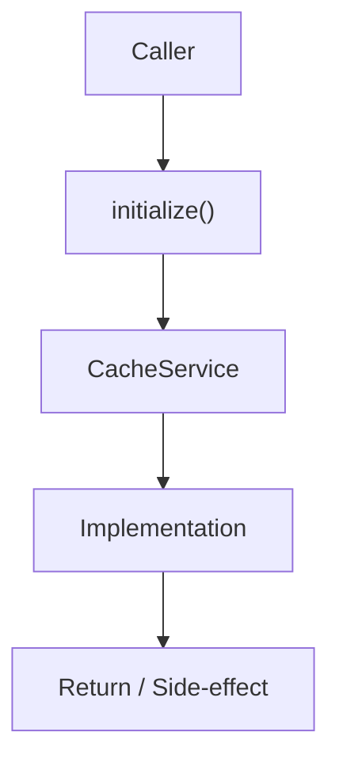

# Community 699 PRD — Enterprise Cache / Redis Initialization

## Master Goal Mapping
- **ALDECI Domain**: Enterprise Cache / Redis Initialization
- **Module**: `CacheService`
- **Source**: `suite-core/core/services/enterprise/cache_service.py:L60`
- **Function/Method**: `initialize`
- **Persona Alignment**: Security Engineer, Platform Operator
- **Strategic Goal**: Provide reliable, well-defined contract for `initialize` within the Enterprise Cache / Redis Initialization subsystem

## Architecture Diagram



## Code Proof

**File**: `suite-core/core/services/enterprise/cache_service.py` — **Line**: `L60`

**Signature**: `classmethod async def initialize(cls, settings: EnterpriseSettings) -> None`

```python
"""Initialize Redis connection pool with enterprise configuration"""
```

## Inter-Dependencies

- `EnterpriseSettings`
- `aioredis`
- `get_instance (L108)`
- `close (L115)`

## Data Flow

settings → create aioredis pool with host/port/pool_size/TLS → store as class singleton

## Referenced Docs

- `docs/ALDECI_REARCHITECTURE_v2.md` — Architecture source of truth
- `suite-core/core/services/enterprise/cache_service.py` — Full module implementation

## Acceptance Criteria

- [ ] Creates Redis pool with configured pool_size
- [ ] Supports TLS for production Redis
- [ ] Sets connection timeout from settings
- [ ] Called once at app startup

## Effort Estimate

**S**

## Status

**Implemented**
