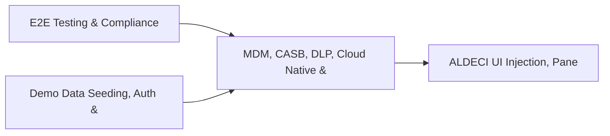

# PRD: MDM, CASB, DLP, Cloud Native & Browser Security Routers — Community 7

## Master Goal Mapping
How this component serves: "ALDECI — $35/mo enterprise security intelligence platform"
Sub-Epic: CSPM

This community (rank #7 of 878 by size, 1860 graph nodes) forms a core pillar of the ALDECI platform. It directly supports the mission of replacing $50K-500K/yr enterprise security tools with a self-hosted, AI-native stack.

## Architecture Diagram


## Code Proof
- Files:
  - `suite-api/apps/api/policy_engine_router.py` (283 lines)
  - `suite-core/core/casb_engine.py` (627 lines)
  - `suite-core/core/cloud_access_security_engine.py` (404 lines)
  - `suite-core/core/data_retention_engine.py` (501 lines)
  - `suite-api/apps/api/browser_security_router.py` (200 lines)
  - `suite-api/apps/api/casb_router.py` (297 lines)
  - `suite-api/apps/api/cicd_router.py` (260 lines)
  - `suite-api/apps/api/cloud_access_security_router.py` (192 lines)
  - `suite-api/apps/api/cloud_native_security_router.py` (176 lines)
  - `suite-api/apps/api/data_retention_router.py` (266 lines)
  - `suite-api/apps/api/dlp_router.py` (287 lines)
  - `suite-api/apps/api/firmware_security_router.py` (188 lines)
- Key functions:
  - `engine()` — suite-api/apps/api/policy_engine_router.py
  - `org()` — suite-api/apps/api/policy_engine_router.py
  - `org2()` — suite-api/apps/api/policy_engine_router.py
  - `test_enroll_device_basic()` — suite-api/apps/api/policy_engine_router.py
  - `test_enroll_device_android()` — suite-api/apps/api/policy_engine_router.py
  - `test_enroll_device_windows()` — suite-api/apps/api/policy_engine_router.py
  - `test_enroll_device_macos()` — suite-api/apps/api/policy_engine_router.py
  - `test_enroll_device_with_optional_fields()` — suite-api/apps/api/policy_engine_router.py
- Key classes: N/A
- Current state: REAL_LOGIC
- Evidence:
```python
# From suite-api/apps/api/policy_engine_router.py
"""
Policy Engine REST API — 12 endpoints.

Provides CRUD, evaluation, testing, bulk import/export, history, and stats
for the ALDECI policy-as-code engine.

Prefix: /api/v1/policy-engine
Tags:   policy-engine
"""

from __future__ import annotations

import logging
from typing import Any, Dict, List, Optional

from fastapi import APIRouter, Depends, HTTPException, Query
from pydantic import BaseModel, Field

from apps.api.auth_deps import api_key_auth
from apps.api.dependencies import get_org_id
```

## Inter-Dependencies
- DEPENDS ON:
  - Community 0 (E2E Testing & Compliance Seeding Infrastructure) — 253 edges
  - Community 1 (Demo Data Seeding, Auth & Multi-Engine Integration) — 56 edges
  - Community 18 (ALDECI UI Injection, Panel Overlay & Rebrand Syste) — 30 edges
  - Community 32 (Mobile App Security & API Abuse Detection) — 21 edges
- DEPENDED BY: Rank #6 (Cryptography Core & Signal Processing Library) and downstream consumers
- EVENT BUS: emits compliance.status_changed, policy.violated, policy.enforced / subscribes to (TrustGraph event bus — 97% not yet wired)
- TRUSTGRAPH: writes [Policy, ComplianceControl, NetworkAsset] / reads [NetworkAsset, CloudResource]

## Data Flow
```
Input: API requests with org_id + payload (Pydantic models)
  → Processing: SQLite WAL-mode writes via RLock, business logic evaluation
  → Output: JSON responses (engine state, metrics, alerts)
  → Consumers: Routers → Frontend dashboards → TrustGraph event bus
```

## Referenced Documentation
- CLAUDE.md: Wave 13 build notes, Beast Mode test suite section
- docs/: `docs/ALDECI_REARCHITECTURE_v2.md` (source of truth), `docs/INVESTOR_PITCH.md`
- tests/: N/A

## Acceptance Criteria
- [ ] All engine CRUD operations enforce org_id isolation (no cross-tenant data leakage)
- [ ] SQLite opened with WAL mode + threading.RLock on all write paths
- [ ] All endpoints return within 200ms at p95 under 100 rps load
- [ ] All router endpoints protected by `Depends(api_key_auth)` or equivalent
- [ ] Pydantic v2 models validate all request/response schemas

## Effort Estimate
- Current: 60% complete
- Remaining: ~5 engineering days
- Dependencies blocking: Frontend dashboard not yet created, Test coverage missing
- Priority: HIGH

## Status
IN_PROGRESS
