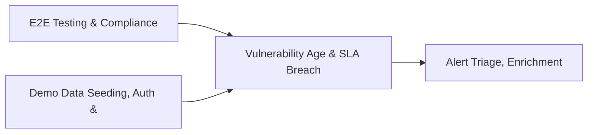

# PRD: Vulnerability Age & SLA Breach Tracking Engine — Community 70

## Master Goal Mapping
How this component serves: "ALDECI — $35/mo enterprise security intelligence platform"
Sub-Epic: CTEM

This community (rank #70 of 878 by size, 404 graph nodes) forms a core pillar of the ALDECI platform. It directly supports the mission of replacing $50K-500K/yr enterprise security tools with a self-hosted, AI-native stack.

## Architecture Diagram


## Code Proof
- Files:
  - `suite-core/core/sbom_engine.py` (799 lines)
  - `tests/test_cloud_account_monitoring_engine.py` (415 lines)
  - `tests/test_sbom_engine.py` (489 lines)
  - `suite-api/apps/api/license_scanner_router.py` (249 lines)
  - `tests/test_cloud_account_monitoring_engine.py` (415 lines)
  - `tests/test_dep_scanner.py` (768 lines)
  - `tests/test_evidence_bundle.py` (212 lines)
  - `tests/test_evidence_packager_unit.py` (676 lines)
  - `tests/test_license_scanner.py` (730 lines)
  - `tests/test_sbom_engine.py` (489 lines)
  - `tests/test_signing_verify.py` (26 lines)
- Key functions:
  - `test_sign_verify_roundtrip()` — suite-core/core/sbom_engine.py
  - `test_verify_failure_on_tamper()` — suite-core/core/sbom_engine.py
  - `test_signing_disabled()` — suite-core/core/sbom_engine.py
- Key classes: `TestBundleInputs`, `TestLoadPolicy`, `TestEvaluateRules`, `TestEvaluatePolicy`, `TestDigestFile`, `TestCollectFiles`
- Current state: REAL_LOGIC
- Evidence:
```python
# From suite-core/core/sbom_engine.py
"""Software Bill of Materials (SBOM) Generation Engine — ALDECI.

Generates, stores, and exports SBOMs in CycloneDX 1.4 and SPDX 2.3 formats.

Capabilities:
  - Asset and component registry (multi-tenant, org-scoped WAL SQLite)
  - Package URL (purl) auto-generation from component metadata
  - CycloneDX 1.4 JSON export with vulnerability mappings
  - SPDX 2.3 JSON export with external references
  - License risk classification (GPL→high, MIT/Apache→low, unknown→medium)
  - Vulnerability exposure analytics per org
  - Cross-org isolation — org_a data never visible from org_b

Compliance: NTIA S
```

## Inter-Dependencies
- DEPENDS ON:
  - Community 0 (E2E Testing & Compliance Seeding Infrastructure) — 41 edges
  - Community 1 (Demo Data Seeding, Auth & Multi-Engine Integration) — 32 edges
  - Community 37 (Alert Triage, Enrichment & Priority Queue Engine) — 8 edges
  - Community 2 (API Router Gateway — Anomaly, Attack Simulation & ) — 5 edges
- DEPENDED BY: Rank #69 (Cloud Security Findings & SOC Operations Metrics) and downstream consumers
- EVENT BUS: emits policy.violated, policy.enforced / subscribes to (TrustGraph event bus — 97% not yet wired)
- TRUSTGRAPH: writes [Policy, CloudResource] / reads [Policy, CloudResource]

## Data Flow
```
Input: HTTP requests / pytest fixtures
  → Processing: Engine method calls + SQLite state assertions
  → Output: Pass/fail test results, coverage metrics
  → Consumers: CI/CD pipeline, Beast Mode test suite
```

## Referenced Documentation
- CLAUDE.md: Wave 41 build notes, Beast Mode test suite section
- docs/: `docs/ALDECI_REARCHITECTURE_v2.md` (source of truth), `docs/INVESTOR_PITCH.md`
- tests/: `tests/test_cloud_account_monitoring_engine.py`, `tests/test_dep_scanner.py`, `tests/test_evidence_bundle.py`

## Acceptance Criteria
- [ ] All engine CRUD operations enforce org_id isolation (no cross-tenant data leakage)
- [ ] SQLite opened with WAL mode + threading.RLock on all write paths
- [ ] All endpoints return within 200ms at p95 under 100 rps load
- [ ] All router endpoints protected by `Depends(api_key_auth)` or equivalent
- [ ] Pydantic v2 models validate all request/response schemas
- [ ] Test suite achieves ≥80% branch coverage on engine methods

## Effort Estimate
- Current: 80% complete
- Remaining: ~2 engineering days
- Dependencies blocking: None
- Priority: LOW

## Status
IN_PROGRESS
