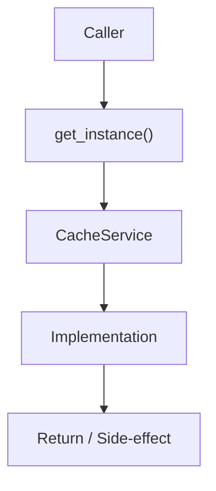

# Community 700 PRD — Enterprise Cache / Singleton Access

## Master Goal Mapping
- **ALDECI Domain**: Enterprise Cache / Singleton Access
- **Module**: `CacheService`
- **Source**: `suite-core/core/services/enterprise/cache_service.py:L108`
- **Function/Method**: `get_instance`
- **Persona Alignment**: Security Engineer, Platform Operator
- **Strategic Goal**: Provide reliable, well-defined contract for `get_instance` within the Enterprise Cache / Singleton Access subsystem

## Architecture Diagram



## Code Proof

**File**: `suite-core/core/services/enterprise/cache_service.py` — **Line**: `L108`

**Signature**: `classmethod def get_instance(cls) -> CacheService`

```python
"""Get singleton instance of CacheService"""
```

## Inter-Dependencies

- `initialize (L60)`
- `MFAManager.verify_backup_code()`
- `redis_queue.py`

## Data Flow

no args → return _instance → raises if not initialized

## Referenced Docs

- `docs/ALDECI_REARCHITECTURE_v2.md` — Architecture source of truth
- `suite-core/core/services/enterprise/cache_service.py` — Full module implementation

## Acceptance Criteria

- [ ] Returns initialized singleton
- [ ] Raises RuntimeError if initialize() not called
- [ ] Used throughout codebase for Redis access

## Effort Estimate

**XS**

## Status

**Implemented**
