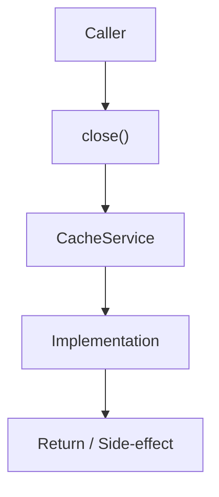

# Community 701 PRD — Enterprise Cache / Graceful Shutdown

## Master Goal Mapping
- **ALDECI Domain**: Enterprise Cache / Graceful Shutdown
- **Module**: `CacheService`
- **Source**: `suite-core/core/services/enterprise/cache_service.py:L115`
- **Function/Method**: `close`
- **Persona Alignment**: Security Engineer, Platform Operator
- **Strategic Goal**: Provide reliable, well-defined contract for `close` within the Enterprise Cache / Graceful Shutdown subsystem

## Architecture Diagram



## Code Proof

**File**: `suite-core/core/services/enterprise/cache_service.py` — **Line**: `L115`

**Signature**: `classmethod async def close(cls) -> None`

```python
"""Close Redis connections"""
```

## Inter-Dependencies

- `aioredis pool.aclose()`
- `FastAPI shutdown lifespan`
- `initialize (L60)`

## Data Flow

app shutdown → pool.aclose() → all Redis connections released

## Referenced Docs

- `docs/ALDECI_REARCHITECTURE_v2.md` — Architecture source of truth
- `suite-core/core/services/enterprise/cache_service.py` — Full module implementation

## Acceptance Criteria

- [ ] Closes Redis pool on call
- [ ] Called in FastAPI shutdown handler
- [ ] Prevents connection leaks on restart

## Effort Estimate

**XS**

## Status

**Implemented**
