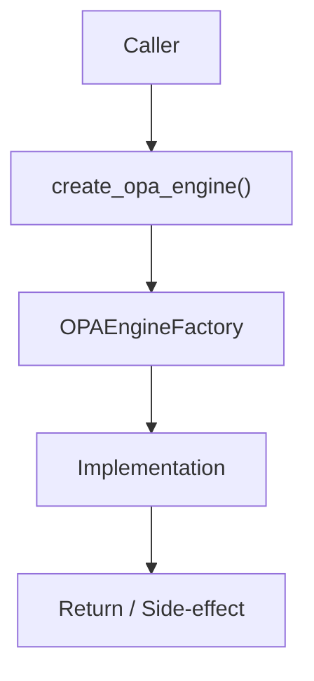

# Community 702 PRD — OPA Policy Engine / Factory

## Master Goal Mapping
- **ALDECI Domain**: OPA Policy Engine / Factory
- **Module**: `OPAEngineFactory`
- **Source**: `suite-core/core/services/enterprise/real_opa_engine.py:L414`
- **Function/Method**: `create_opa_engine`
- **Persona Alignment**: Security Engineer, Platform Operator
- **Strategic Goal**: Provide reliable, well-defined contract for `create_opa_engine` within the OPA Policy Engine / Factory subsystem

## Architecture Diagram



## Code Proof

**File**: `suite-core/core/services/enterprise/real_opa_engine.py` — **Line**: `L414`

**Signature**: `def create_opa_engine() -> BaseOPAEngine`

```python
"""Create OPA engine — uses ProductionOPAEngine if OPA_SERVER_URL is set, otherwise MockOPAEngine"""
```

## Inter-Dependencies

- `ProductionOPAEngine`
- `MockOPAEngine`
- `zero_trust_policy_engine.py`
- `OPA_SERVER_URL env var`

## Data Flow

env check OPA_SERVER_URL → ProductionOPAEngine(url) or MockOPAEngine()

## Referenced Docs

- `docs/ALDECI_REARCHITECTURE_v2.md` — Architecture source of truth
- `suite-core/core/services/enterprise/real_opa_engine.py` — Full module implementation

## Acceptance Criteria

- [ ] Returns ProductionOPAEngine when OPA_SERVER_URL set
- [ ] Returns MockOPAEngine in dev/test
- [ ] Both satisfy BaseOPAEngine interface

## Effort Estimate

**XS**

## Status

**Implemented**
