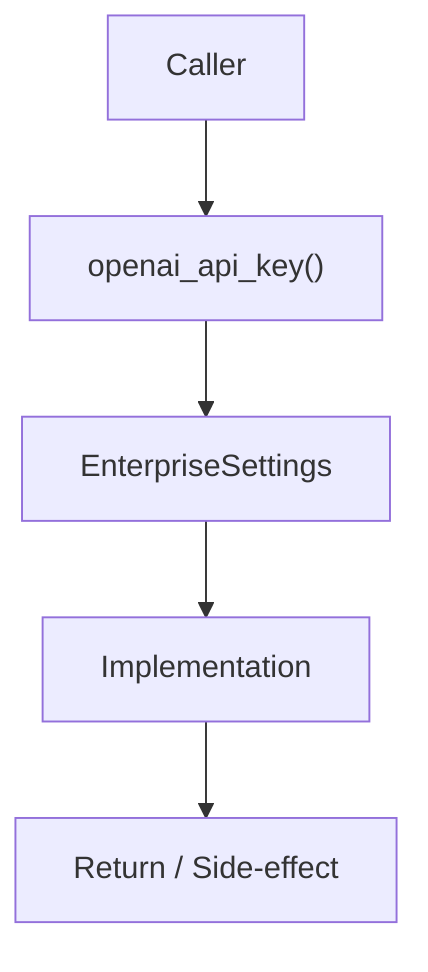

# Community 703 PRD — Enterprise Config / API Key Resolution

## Master Goal Mapping
- **ALDECI Domain**: Enterprise Config / API Key Resolution
- **Module**: `EnterpriseSettings`
- **Source**: `suite-core/config/enterprise/settings.py:L240`
- **Function/Method**: `openai_api_key`
- **Persona Alignment**: Security Engineer, Platform Operator
- **Strategic Goal**: Provide reliable, well-defined contract for `openai_api_key` within the Enterprise Config / API Key Resolution subsystem

## Architecture Diagram



## Code Proof

**File**: `suite-core/config/enterprise/settings.py` — **Line**: `L240`

**Signature**: `@property def openai_api_key(self) -> Optional[str]`

```python
"""Return the preferred API key for ChatGPT-backed features."""
```

## Inter-Dependencies

- `OPENAI_API_KEY env`
- `OPENROUTER_API_KEY env`
- `ai_security_advisor_engine.py`
- `single_agent.py`

## Data Flow

env lookup OPENAI_API_KEY → fallback OPENROUTER_API_KEY → Optional[str]

## Referenced Docs

- `docs/ALDECI_REARCHITECTURE_v2.md` — Architecture source of truth
- `suite-core/config/enterprise/settings.py` — Full module implementation

## Acceptance Criteria

- [ ] Returns OPENAI_API_KEY when set
- [ ] Falls back to OPENROUTER_API_KEY
- [ ] Returns None when neither set
- [ ] Never raises

## Effort Estimate

**XS**

## Status

**Implemented**
