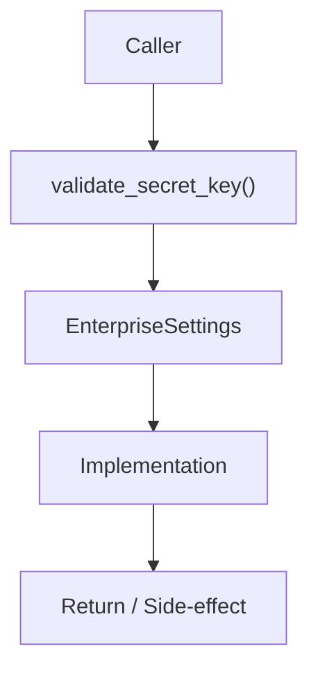

# Community 704 PRD — Enterprise Config / Secret Key Validation

## Master Goal Mapping
- **ALDECI Domain**: Enterprise Config / Secret Key Validation
- **Module**: `EnterpriseSettings`
- **Source**: `suite-core/config/enterprise/settings.py:L256`
- **Function/Method**: `validate_secret_key`
- **Persona Alignment**: Security Engineer, Platform Operator
- **Strategic Goal**: Provide reliable, well-defined contract for `validate_secret_key` within the Enterprise Config / Secret Key Validation subsystem

## Architecture Diagram



## Code Proof

**File**: `suite-core/config/enterprise/settings.py` — **Line**: `L256`

**Signature**: `@validator('SECRET_KEY') def validate_secret_key(cls, v) -> str`

```python
"""Resolve SECRET_KEY with production safety enforcement.
Called by pydantic field validator.
"""
```

## Inter-Dependencies

- `pydantic BaseSettings`
- `SECRET_KEY field`
- `JWT signing in auth modules`

## Data Flow

SECRET_KEY value → length check + default detection → raise ValueError or return value

## Referenced Docs

- `docs/ALDECI_REARCHITECTURE_v2.md` — Architecture source of truth
- `suite-core/config/enterprise/settings.py` — Full module implementation

## Acceptance Criteria

- [ ] Raises ValueError for keys < 32 chars
- [ ] Raises ValueError for known default values
- [ ] Passes valid long random keys
- [ ] Only enforced in production env

## Effort Estimate

**XS**

## Status

**Implemented**
