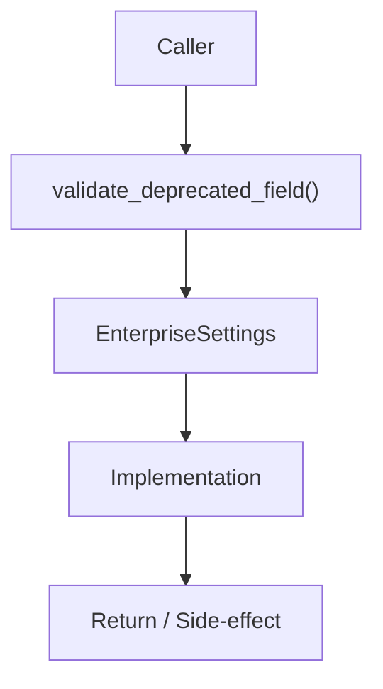

# Community 705 PRD — Enterprise Config / Backwards Compatibility

## Master Goal Mapping
- **ALDECI Domain**: Enterprise Config / Backwards Compatibility
- **Module**: `EnterpriseSettings`
- **Source**: `suite-core/config/enterprise/settings.py:L292`
- **Function/Method**: `validate_deprecated_field`
- **Persona Alignment**: Security Engineer, Platform Operator
- **Strategic Goal**: Provide reliable, well-defined contract for `validate_deprecated_field` within the Enterprise Config / Backwards Compatibility subsystem

## Architecture Diagram



## Code Proof

**File**: `suite-core/config/enterprise/settings.py` — **Line**: `L292`

**Signature**: `@validator('...') def validate_deprecated_field(cls, v) -> Any`

```python
"""No-op validator kept for backwards compatibility."""
```

## Inter-Dependencies

- `pydantic BaseSettings`
- `deprecated config fields`

## Data Flow

field value → pass through unchanged

## Referenced Docs

- `docs/ALDECI_REARCHITECTURE_v2.md` — Architecture source of truth
- `suite-core/config/enterprise/settings.py` — Full module implementation

## Acceptance Criteria

- [ ] Returns value unchanged
- [ ] Does not raise
- [ ] Enables old config files to load without error

## Effort Estimate

**XS**

## Status

**Implemented**
