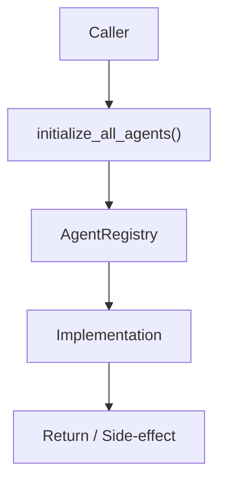

# Community 708 PRD — MindsDB Agents / Registry Initialization

## Master Goal Mapping
- **ALDECI Domain**: MindsDB Agents / Registry Initialization
- **Module**: `AgentRegistry`
- **Source**: `suite-core/agents/mindsdb_agents.py:L904`
- **Function/Method**: `initialize_all_agents`
- **Persona Alignment**: Security Engineer, Platform Operator
- **Strategic Goal**: Provide reliable, well-defined contract for `initialize_all_agents` within the MindsDB Agents / Registry Initialization subsystem

## Architecture Diagram



## Code Proof

**File**: `suite-core/agents/mindsdb_agents.py` — **Line**: `L904`

**Signature**: `def initialize_all_agents(settings: EnterpriseSettings) -> AgentRegistry`

```python
"""Initialize all agents."""
```

## Inter-Dependencies

- `SecurityCopilotAgent`
- `ThreatAnalysisAgent`
- `ComplianceAgent`
- `EnterpriseSettings`

## Data Flow

settings → instantiate each agent class → AgentRegistry with all agents keyed by type

## Referenced Docs

- `docs/ALDECI_REARCHITECTURE_v2.md` — Architecture source of truth
- `suite-core/agents/mindsdb_agents.py` — Full module implementation

## Acceptance Criteria

- [ ] All defined agent types instantiated
- [ ] Registry populated and returned
- [ ] Agents receive settings for API key config
- [ ] Called once at app startup

## Effort Estimate

**S**

## Status

**Implemented**
