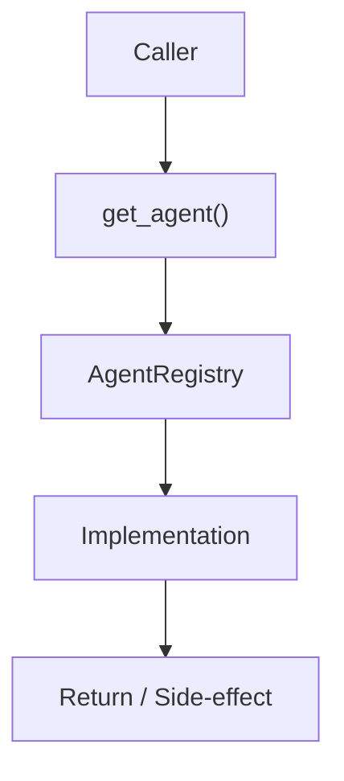

# Community 709 PRD — MindsDB Agents / Registry Lookup

## Master Goal Mapping
- **ALDECI Domain**: MindsDB Agents / Registry Lookup
- **Module**: `AgentRegistry`
- **Source**: `suite-core/agents/mindsdb_agents.py:L931`
- **Function/Method**: `get_agent`
- **Persona Alignment**: Security Engineer, Platform Operator
- **Strategic Goal**: Provide reliable, well-defined contract for `get_agent` within the MindsDB Agents / Registry Lookup subsystem

## Architecture Diagram



## Code Proof

**File**: `suite-core/agents/mindsdb_agents.py` — **Line**: `L931`

**Signature**: `def get_agent(self, agent_type: str) -> Optional[BaseMindsDBAgent]`

```python
"""Get an agent by type."""
```

## Inter-Dependencies

- `_registry dict`
- `initialize_all_agents (L904)`
- `copilot_router.py`

## Data Flow

agent_type string → dict lookup → BaseMindsDBAgent or None

## Referenced Docs

- `docs/ALDECI_REARCHITECTURE_v2.md` — Architecture source of truth
- `suite-core/agents/mindsdb_agents.py` — Full module implementation

## Acceptance Criteria

- [ ] Returns agent for known types
- [ ] Returns None for unknown types
- [ ] Case-insensitive lookup

## Effort Estimate

**XS**

## Status

**Implemented**
