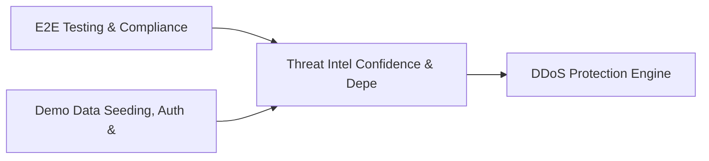

# PRD: Threat Intel Confidence & Dependency Risk Engine — Community 71

## Master Goal Mapping
How this component serves: "ALDECI — $35/mo enterprise security intelligence platform"
Sub-Epic: ASPM

This community (rank #71 of 878 by size, 367 graph nodes) forms a core pillar of the ALDECI platform. It directly supports the mission of replacing $50K-500K/yr enterprise security tools with a self-hosted, AI-native stack.

## Architecture Diagram


## Code Proof
- Files:
  - `suite-attack/attack/fail_engine.py` (4811 lines)
  - `suite-core/core/fail_engine.py` (717 lines)
  - `suite-api/apps/api/composite_risk_router.py` (231 lines)
  - `suite-api/apps/api/fail_router.py` (885 lines)
  - `suite-api/apps/api/risk_scoring_router.py` (232 lines)
  - `suite-attack/api/fail_router.py` (822 lines)
  - `tests/test_composite_risk_scorer.py` (494 lines)
  - `tests/test_fail_db.py` (146 lines)
  - `tests/test_risk_prioritizer.py` (444 lines)
- Key functions:
  - `test_score_finding_returns_risk_score()` — suite-attack/attack/fail_engine.py
  - `test_score_finding_critical_production_high_score()` — suite-attack/attack/fail_engine.py
  - `test_score_finding_low_info_dev_low_score()` — suite-attack/attack/fail_engine.py
  - `tmp_db()` — suite-attack/attack/fail_engine.py
  - `scorer()` — suite-attack/attack/fail_engine.py
  - `db()` — suite-attack/attack/fail_engine.py
  - `_utcnow_iso()` — suite-attack/attack/fail_engine.py
  - `_build_scenario_library()` — suite-attack/attack/fail_engine.py
- Key classes: `TestGradeScore`, `TestRiskFactor`, `TestFormulaCorrectness`, `TestBatchScoring`, `TestTopRisks`, `TestPersistence`
- Current state: REAL_LOGIC
- Evidence:
```python
# From suite-attack/attack/fail_engine.py
"""
FixOps FAIL Engine — Fault & Attack Injection Layer
suite-attack edition

The FAIL Engine is a chaos engineering system for security teams. It injects
synthetic vulnerabilities into the FixOps finding pipeline, then measures how
fast and accurately the security team detects, triages, and remediates them.

This is NOT a CVSS scoring engine. It is a readiness measurement system:
  - Inject a synthetic Log4Shell finding at 09:00
  - Measure: detected at 09:14 (14 min), triaged as CRITICAL at 09:21, fix PR at 10:43
  - Score: Detection=8.2, Triage=9.0, Remediation=7.1, Communication=6.5 → Over
```

## Inter-Dependencies
- DEPENDS ON:
  - Community 0 (E2E Testing & Compliance Seeding Infrastructure) — 90 edges
  - Community 1 (Demo Data Seeding, Auth & Multi-Engine Integration) — 19 edges
  - Community 16 (DDoS Protection Engine) — 9 edges
  - Community 44 (Security Health Scorecard & Posture History) — 4 edges
- DEPENDED BY: Rank #70 (Vulnerability Age & SLA Breach Tracking Engine) and downstream consumers
- EVENT BUS: emits vulnerability.detected, vulnerability.patched, asset.registered, asset.updated / subscribes to (TrustGraph event bus — 97% not yet wired)
- TRUSTGRAPH: writes [Vulnerability, Asset] / reads [Vulnerability, Asset]

## Data Flow
```
Input: HTTP requests / pytest fixtures
  → Processing: Engine method calls + SQLite state assertions
  → Output: Pass/fail test results, coverage metrics
  → Consumers: CI/CD pipeline, Beast Mode test suite
```

## Referenced Documentation
- CLAUDE.md: Wave 41 build notes, Beast Mode test suite section
- docs/: `docs/ALDECI_REARCHITECTURE_v2.md` (source of truth), `docs/INVESTOR_PITCH.md`
- tests/: `tests/test_composite_risk_scorer.py`, `tests/test_fail_db.py`, `tests/test_risk_prioritizer.py`

## Acceptance Criteria
- [ ] All engine CRUD operations enforce org_id isolation (no cross-tenant data leakage)
- [ ] SQLite opened with WAL mode + threading.RLock on all write paths
- [ ] All endpoints return within 200ms at p95 under 100 rps load
- [ ] All router endpoints protected by `Depends(api_key_auth)` or equivalent
- [ ] Pydantic v2 models validate all request/response schemas
- [ ] Test suite achieves ≥80% branch coverage on engine methods

## Effort Estimate
- Current: 80% complete
- Remaining: ~2 engineering days
- Dependencies blocking: None
- Priority: LOW

## Status
IN_PROGRESS
