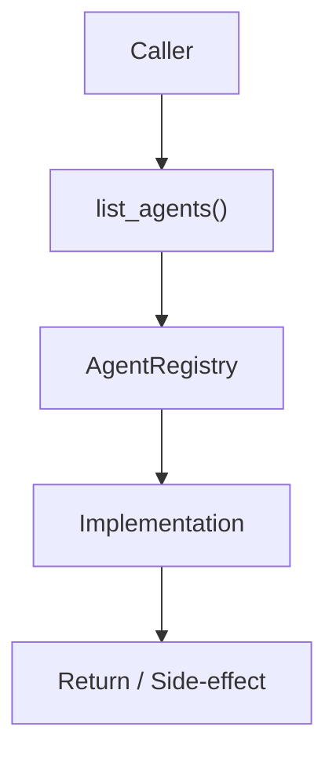

# Community 710 PRD — MindsDB Agents / Registry Listing

## Master Goal Mapping
- **ALDECI Domain**: MindsDB Agents / Registry Listing
- **Module**: `AgentRegistry`
- **Source**: `suite-core/agents/mindsdb_agents.py:L936`
- **Function/Method**: `list_agents`
- **Persona Alignment**: Security Engineer, Platform Operator
- **Strategic Goal**: Provide reliable, well-defined contract for `list_agents` within the MindsDB Agents / Registry Listing subsystem

## Architecture Diagram



## Code Proof

**File**: `suite-core/agents/mindsdb_agents.py` — **Line**: `L936`

**Signature**: `def list_agents(self) -> List[str]`

```python
"""List all available agents."""
```

## Inter-Dependencies

- `_registry dict`
- `AgentRegistry`
- `/api/v1/agents endpoint`

## Data Flow

no input → sorted list of registered agent type strings

## Referenced Docs

- `docs/ALDECI_REARCHITECTURE_v2.md` — Architecture source of truth
- `suite-core/agents/mindsdb_agents.py` — Full module implementation

## Acceptance Criteria

- [ ] Returns all registered agent types
- [ ] Used by API to expose available agents
- [ ] Returns empty list if none registered

## Effort Estimate

**XS**

## Status

**Implemented**
