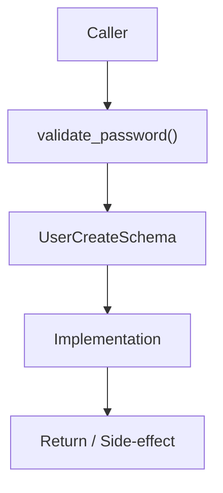

# Community 714 PRD — User Schema / Password Strength Validation

## Master Goal Mapping
- **ALDECI Domain**: User Schema / Password Strength Validation
- **Module**: `UserCreateSchema`
- **Source**: `suite-core/schemas/enterprise/user.py:L88`
- **Function/Method**: `validate_password`
- **Persona Alignment**: Security Engineer, Platform Operator
- **Strategic Goal**: Provide reliable, well-defined contract for `validate_password` within the User Schema / Password Strength Validation subsystem

## Architecture Diagram



## Code Proof

**File**: `suite-core/schemas/enterprise/user.py` — **Line**: `L88`

**Signature**: `@validator('password') def validate_password(cls, v) -> str`

```python
"""Validate password strength"""
```

## Inter-Dependencies

- `UserCreateSchema`
- `PasswordManager.hash_password()`
- `auth router`

## Data Flow

raw password string → length + complexity checks → raise ValueError or return value

## Referenced Docs

- `docs/ALDECI_REARCHITECTURE_v2.md` — Architecture source of truth
- `suite-core/schemas/enterprise/user.py` — Full module implementation

## Acceptance Criteria

- [ ] Rejects passwords shorter than 8 chars
- [ ] Requires at least one uppercase
- [ ] Requires at least one digit or special char
- [ ] Raises ValidationError with clear message

## Effort Estimate

**XS**

## Status

**Implemented**
