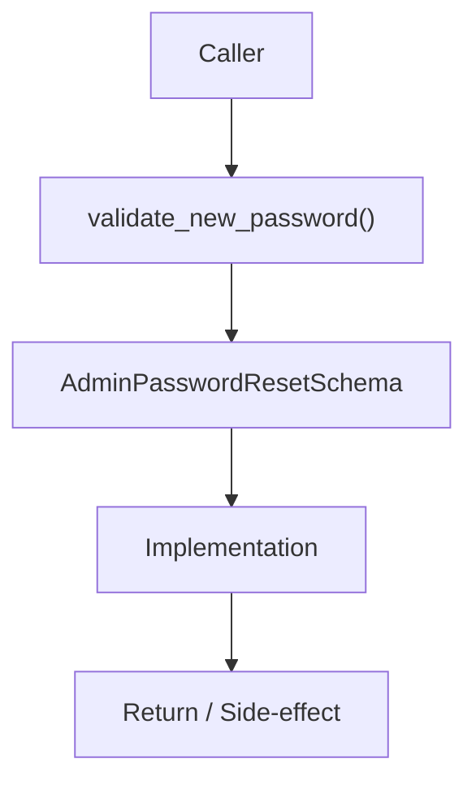

# Community 716 PRD — User Schema / Admin Password Reset Validation

## Master Goal Mapping
- **ALDECI Domain**: User Schema / Admin Password Reset Validation
- **Module**: `AdminPasswordResetSchema`
- **Source**: `suite-core/schemas/enterprise/user.py:L197`
- **Function/Method**: `validate_new_password`
- **Persona Alignment**: Security Engineer, Platform Operator
- **Strategic Goal**: Provide reliable, well-defined contract for `validate_new_password` within the User Schema / Admin Password Reset Validation subsystem

## Architecture Diagram



## Code Proof

**File**: `suite-core/schemas/enterprise/user.py` — **Line**: `L197`

**Signature**: `@validator('new_password') def validate_new_password(cls, v) -> str`

```python
"""Validate new password strength"""
```

## Inter-Dependencies

- `AdminPasswordResetSchema`
- `PasswordManager.hash_password()`
- `admin router`

## Data Flow

admin-supplied new_password → strength validation → raise or return

## Referenced Docs

- `docs/ALDECI_REARCHITECTURE_v2.md` — Architecture source of truth
- `suite-core/schemas/enterprise/user.py` — Full module implementation

## Acceptance Criteria

- [ ] Validates same strength rules
- [ ] Used in admin force-reset flow
- [ ] Separate schema from user self-service change

## Effort Estimate

**XS**

## Status

**Implemented**
