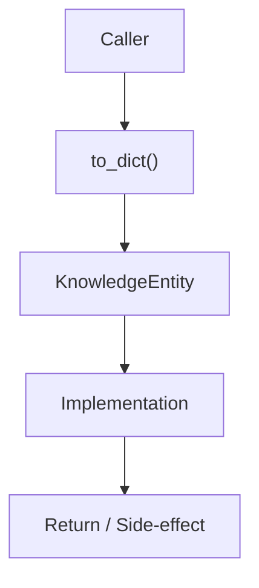

# Community 717 PRD — TrustGraph / GraphRAG Serialization

## Master Goal Mapping
- **ALDECI Domain**: TrustGraph / GraphRAG Serialization
- **Module**: `KnowledgeEntity`
- **Source**: `suite-core/trustgraph/graph_rag.py:L373`
- **Function/Method**: `to_dict`
- **Persona Alignment**: Security Engineer, Platform Operator
- **Strategic Goal**: Provide reliable, well-defined contract for `to_dict` within the TrustGraph / GraphRAG Serialization subsystem

## Architecture Diagram



## Code Proof

**File**: `suite-core/trustgraph/graph_rag.py` — **Line**: `L373`

**Signature**: `def to_dict(self) -> Dict[str, Any]`

```python
"""Convert KnowledgeEntity to a serialisable dict."""
```

## Inter-Dependencies

- `KnowledgeEntity dataclass`
- `GraphRAGRetriever.retrieve()`
- `copilot_router.py`

## Data Flow

KnowledgeEntity(id, type, properties, relationships) → Dict ready for json.dumps()

## Referenced Docs

- `docs/ALDECI_REARCHITECTURE_v2.md` — Architecture source of truth
- `suite-core/trustgraph/graph_rag.py` — Full module implementation

## Acceptance Criteria

- [ ] Returns JSON-serialisable dict
- [ ] Includes all entity properties
- [ ] Nested relationships serialised correctly
- [ ] Used in GraphRAG API responses

## Effort Estimate

**XS**

## Status

**Implemented**
