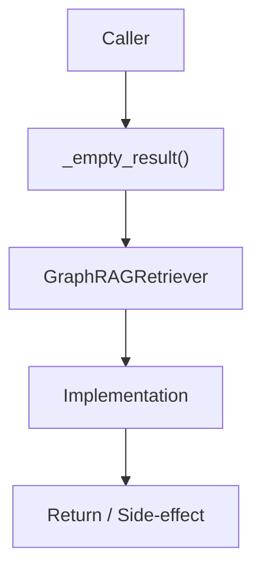

# Community 718 PRD — TrustGraph / GraphRAG Empty Result

## Master Goal Mapping
- **ALDECI Domain**: TrustGraph / GraphRAG Empty Result
- **Module**: `GraphRAGRetriever`
- **Source**: `suite-core/trustgraph/graph_rag.py:L384`
- **Function/Method**: `_empty_result`
- **Persona Alignment**: Security Engineer, Platform Operator
- **Strategic Goal**: Provide reliable, well-defined contract for `_empty_result` within the TrustGraph / GraphRAG Empty Result subsystem

## Architecture Diagram



## Code Proof

**File**: `suite-core/trustgraph/graph_rag.py` — **Line**: `L384`

**Signature**: `staticmethod def _empty_result(self) -> GraphRAGResult`

```python
"""Return a well-formed empty result."""
```

## Inter-Dependencies

- `GraphRAGResult dataclass`
- `GraphRAGRetriever.retrieve()`
- `copilot_router.py`

## Data Flow

no input → GraphRAGResult(entities=[], relationships=[], context_text='', confidence=0.0)

## Referenced Docs

- `docs/ALDECI_REARCHITECTURE_v2.md` — Architecture source of truth
- `suite-core/trustgraph/graph_rag.py` — Full module implementation

## Acceptance Criteria

- [ ] Returns valid GraphRAGResult with empty collections
- [ ] confidence=0.0 signals no context found
- [ ] Callers check confidence before using context
- [ ] Prevents None propagation in retrieval pipeline

## Effort Estimate

**XS**

## Status

**Implemented**
