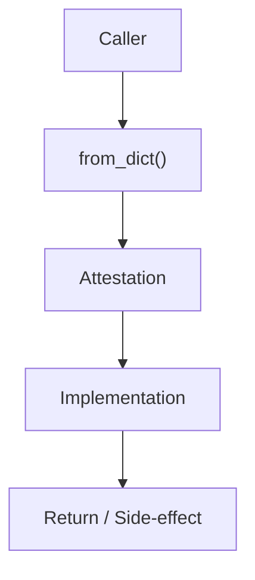

# Community 719 PRD — Provenance / Attestation Deserialization

## Master Goal Mapping
- **ALDECI Domain**: Provenance / Attestation Deserialization
- **Module**: `Attestation`
- **Source**: `suite-core/services/provenance/attestation.py:L178`
- **Function/Method**: `from_dict`
- **Persona Alignment**: Security Engineer, Platform Operator
- **Strategic Goal**: Provide reliable, well-defined contract for `from_dict` within the Provenance / Attestation Deserialization subsystem

## Architecture Diagram



## Code Proof

**File**: `suite-core/services/provenance/attestation.py` — **Line**: `L178`

**Signature**: `classmethod def from_dict(cls, data: Dict) -> Attestation`

```python
"""Hydrate an attestation from a dictionary, validating basic structure."""
```

## Inter-Dependencies

- `Attestation dataclass`
- `AttestationStore.load()`
- `sbom_export_engine.py`
- `evidence_chain_engine.py`

## Data Flow

dict (from JSON/DB) → field extraction + type validation → Attestation object

## Referenced Docs

- `docs/ALDECI_REARCHITECTURE_v2.md` — Architecture source of truth
- `suite-core/services/provenance/attestation.py` — Full module implementation

## Acceptance Criteria

- [ ] Raises ValueError for missing required fields
- [ ] Parses timestamp strings to datetime
- [ ] Returns valid Attestation on well-formed input
- [ ] Used in evidence chain hydration from DB

## Effort Estimate

**XS**

## Status

**Implemented**
