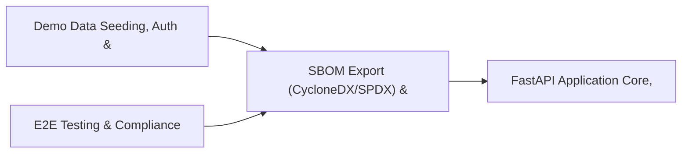

# PRD: SBOM Export (CycloneDX/SPDX) & Gap Analysis Engine — Community 72

## Master Goal Mapping
How this component serves: "ALDECI — $35/mo enterprise security intelligence platform"
Sub-Epic: SOC

This community (rank #72 of 878 by size, 341 graph nodes) forms a core pillar of the ALDECI platform. It directly supports the mission of replacing $50K-500K/yr enterprise security tools with a self-hosted, AI-native stack.

## Architecture Diagram


## Code Proof
- Files:
  - `tests/test_aws_real.py` (834 lines)
  - `tests/test_storage_backends_unit.py` (538 lines)
- Key functions:
  - `_localstack_is_up()` — suite-core/core/aws_integration.py
  - `_localstack_services()` — suite-core/core/aws_integration.py
  - `s3_store()` — suite-core/core/aws_integration.py
  - `sh_pusher()` — suite-core/core/aws_integration.py
  - `iam_auditor()` — suite-core/core/aws_integration.py
  - `cw_metrics()` — suite-core/core/aws_integration.py
  - `_make_finding()` — suite-core/core/aws_integration.py
  - `test_push_single_high_finding()` — suite-core/core/aws_integration.py
- Key classes: `TestS3EvidenceStore`, `TestSecurityHubPusher`, `TestIAMAuditor`, `TestCloudWatchMetrics`, `TestCrossServiceIntegration`
- Current state: CRUD_ONLY
- Evidence:
```python
# From suite-core/core/aws_integration.py
"""
ALDECI AWS Integration — Real boto3 calls against LocalStack (or live AWS).

Provides four integration areas:
1. S3EvidenceStore      — Upload scan reports, SBOM files, compliance evidence
2. SecurityHubPusher    — Convert ALDECI findings to ASFF and push to Security Hub
3. IAMAuditor           — Audit IAM users, MFA enforcement, overprivileged policies
4. CloudWatchMetrics    — Push ALDECI metrics (finding counts, risk scores, scan durations)

All clients accept an optional ``endpoint_url`` that defaults to
``http://localhost:4566`` (LocalStack). For real AWS, pass ``endpoint_url=None``.

```

## Inter-Dependencies
- DEPENDS ON:
  - Community 1 (Demo Data Seeding, Auth & Multi-Engine Integration) — 51 edges
  - Community 0 (E2E Testing & Compliance Seeding Infrastructure) — 42 edges
  - Community 4 (FastAPI Application Core, Feedback & Smoke Testing) — 12 edges
  - Community 37 (Alert Triage, Enrichment & Priority Queue Engine) — 10 edges
- DEPENDED BY: Rank #71 (Threat Intel Confidence & Dependency Risk Engine) and downstream consumers
- EVENT BUS: emits compliance.status_changed, user.risk_changed / subscribes to (TrustGraph event bus — 97% not yet wired)
- TRUSTGRAPH: writes [Identity, ComplianceControl, CloudResource] / reads [ComplianceControl, CloudResource]

## Data Flow
```
Input: HTTP requests / pytest fixtures
  → Processing: Engine method calls + SQLite state assertions
  → Output: Pass/fail test results, coverage metrics
  → Consumers: CI/CD pipeline, Beast Mode test suite
```

## Referenced Documentation
- CLAUDE.md: Wave 41 build notes, Beast Mode test suite section
- docs/: `docs/ALDECI_REARCHITECTURE_v2.md` (source of truth), `docs/INVESTOR_PITCH.md`
- tests/: `tests/test_aws_real.py`, `tests/test_storage_backends_unit.py`

## Acceptance Criteria
- [ ] Test suite achieves ≥80% branch coverage on engine methods
- [ ] All tests pass with `pytest --timeout=10 -q` in <30 seconds

## Effort Estimate
- Current: 20% complete
- Remaining: ~15 engineering days
- Dependencies blocking: Engine implementation incomplete
- Priority: LOW

## Status
TODO
