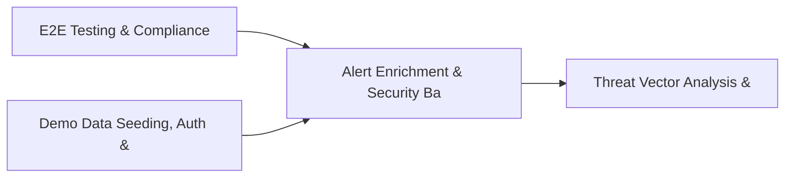

# PRD: Alert Enrichment & Security Baseline Engine — Community 73

## Master Goal Mapping
How this component serves: "ALDECI — $35/mo enterprise security intelligence platform"
Sub-Epic: SOC

This community (rank #73 of 878 by size, 337 graph nodes) forms a core pillar of the ALDECI platform. It directly supports the mission of replacing $50K-500K/yr enterprise security tools with a self-hosted, AI-native stack.

## Architecture Diagram


## Code Proof
- Files:
  - `suite-core/core/container_registry_security_engine.py` (447 lines)
  - `tests/test_container_registry_security_engine.py` (351 lines)
  - `suite-api/apps/api/container_registry_security_router.py` (184 lines)
  - `suite-ui/aldeci-ui-new/src/pages/FeedSubscriptionsDashboard.tsx` (329 lines)
  - `suite-ui/aldeci-ui-new/src/pages/vendors/VendorManagement.tsx` (1148 lines)
  - `tests/test_container_registry_security_engine.py` (351 lines)
  - `tests/test_flags.py` (555 lines)
- Key functions:
  - `engine()` — suite-core/core/container_registry_security_engine.py
  - `org()` — suite-core/core/container_registry_security_engine.py
  - `org2()` — suite-core/core/container_registry_security_engine.py
  - `_registry()` — suite-core/core/container_registry_security_engine.py
  - `_scan()` — suite-core/core/container_registry_security_engine.py
  - `_policy()` — suite-core/core/container_registry_security_engine.py
  - `test_register_registry_returns_record()` — suite-core/core/container_registry_security_engine.py
  - `test_register_registry_missing_name_raises()` — suite-core/core/container_registry_security_engine.py
- Key classes: `FakeFlagProvider`, `FeatureFlagProvider`, `TestEvaluationContext`, `TestLocalOverlayProvider`, `TestCombinedProvider`, `TestLaunchDarklyProvider`
- Current state: REAL_LOGIC
- Evidence:
```python
# From suite-core/core/container_registry_security_engine.py
"""Container Registry Security Engine — ALDECI.

Manages container registries, image vulnerability scans, and policy enforcement.

Capabilities:
  - Registry registry (Docker Hub, ECR, GCR, ACR, Harbor)
  - Image scanning with CVE tracking and scan scoring
  - Policy engine: block critical, max high vulns, require signed images
  - Policy evaluation per scan: allow / warn / block with violation details
  - Stats aggregation per org

Compliance: CIS Docker Benchmark, NIST SP 800-190, OCI image spec
"""

from __future__ import annotations

import json
import logging
import sqlite3
import threadi
```

## Inter-Dependencies
- DEPENDS ON:
  - Community 0 (E2E Testing & Compliance Seeding Infrastructure) — 19 edges
  - Community 1 (Demo Data Seeding, Auth & Multi-Engine Integration) — 15 edges
  - Community 51 (Threat Vector Analysis & Awareness Campaign Engine) — 5 edges
  - Community 7 (MDM, CASB, DLP, Cloud Native & Browser Security Ro) — 4 edges
- DEPENDED BY: Rank #72 (SBOM Export (CycloneDX/SPDX) & Gap Analysis Engine) and downstream consumers
- EVENT BUS: emits vulnerability.detected, vulnerability.patched, policy.violated, policy.enforced / subscribes to (TrustGraph event bus — 97% not yet wired)
- TRUSTGRAPH: writes [Vulnerability, Policy] / reads [Vulnerability, Policy]

## Data Flow
```
Input: HTTP requests / pytest fixtures
  → Processing: Engine method calls + SQLite state assertions
  → Output: Pass/fail test results, coverage metrics
  → Consumers: CI/CD pipeline, Beast Mode test suite
```

## Referenced Documentation
- CLAUDE.md: Wave 41 build notes, Beast Mode test suite section
- docs/: `docs/ALDECI_REARCHITECTURE_v2.md` (source of truth), `docs/INVESTOR_PITCH.md`
- tests/: `tests/test_container_registry_security_engine.py`, `tests/test_flags.py`

## Acceptance Criteria
- [ ] All engine CRUD operations enforce org_id isolation (no cross-tenant data leakage)
- [ ] SQLite opened with WAL mode + threading.RLock on all write paths
- [ ] All endpoints return within 200ms at p95 under 100 rps load
- [ ] All router endpoints protected by `Depends(api_key_auth)` or equivalent
- [ ] Pydantic v2 models validate all request/response schemas
- [ ] Test suite achieves ≥80% branch coverage on engine methods

## Effort Estimate
- Current: 95% complete
- Remaining: ~1 engineering days
- Dependencies blocking: None
- Priority: LOW

## Status
IN_PROGRESS
