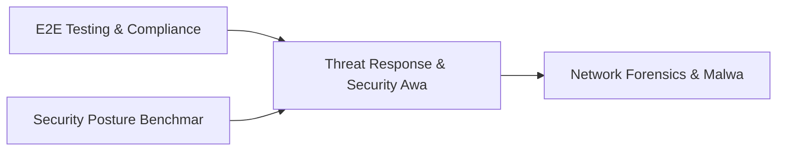

# PRD: Threat Response & Security Awareness Program Engine — Community 74

## Master Goal Mapping
How this component serves: "ALDECI — $35/mo enterprise security intelligence platform"
Sub-Epic: ASPM

This community (rank #74 of 878 by size, 332 graph nodes) forms a core pillar of the ALDECI platform. It directly supports the mission of replacing $50K-500K/yr enterprise security tools with a self-hosted, AI-native stack.

## Architecture Diagram


## Code Proof
- Files:
  - `suite-core/core/security_metrics_dashboard_engine.py` (423 lines)
  - `tests/test_cloud_cost_security_engine.py` (575 lines)
  - `tests/test_security_metrics_dashboard_engine.py` (321 lines)
  - `tests/test_security_posture_history_engine.py` (342 lines)
  - `tests/test_vuln_trend_engine.py` (264 lines)
  - `suite-api/apps/api/cloud_cost_security_router.py` (289 lines)
  - `suite-api/apps/api/dashboard_builder_router.py` (319 lines)
  - `suite-api/apps/api/integration_health_router.py` (211 lines)
  - `suite-api/apps/api/security_health_router.py` (170 lines)
  - `suite-api/apps/api/security_metrics_dashboard_router.py` (165 lines)
  - `suite-api/apps/api/vuln_trend_router.py` (152 lines)
  - `tests/test_cloud_cost_security_engine.py` (575 lines)
- Key functions:
  - `test_get_dashboard_empty()` — suite-core/core/security_metrics_dashboard_engine.py
  - `_past_iso()` — suite-core/core/security_metrics_dashboard_engine.py
  - `test_record_snapshot_returns_dict()` — suite-core/core/security_metrics_dashboard_engine.py
  - `test_record_snapshot_has_uuid_id()` — suite-core/core/security_metrics_dashboard_engine.py
  - `test_record_snapshot_computes_change_pct()` — suite-core/core/security_metrics_dashboard_engine.py
  - `test_record_snapshot_invalid_provider_raises()` — suite-core/core/security_metrics_dashboard_engine.py
  - `test_record_snapshot_spike_detected()` — suite-core/core/security_metrics_dashboard_engine.py
  - `test_record_snapshot_no_spike_below_threshold()` — suite-core/core/security_metrics_dashboard_engine.py
- Key classes: `TestDashboardCRUD`, `TestWidgetManagement`
- Current state: REAL_LOGIC
- Evidence:
```python
# From suite-core/core/security_metrics_dashboard_engine.py
"""Security Metrics Dashboard Engine — ALDECI.

Dashboard registry with widget management and metric snapshot tracking.

Capabilities:
  - Dashboard CRUD with type filtering and org isolation
  - Widget management per dashboard (chart/table/gauge/counter/heatmap/timeline)
  - Metric snapshot ingestion and time-series history
  - Stats: total dashboards, by type, total widgets, snapshots in last 24h

Compliance: SOC2 CC7.2, NIST SP 800-137 (continuous monitoring)
"""

from __future__ import annotations

import json
import logging
import sqlite3
import threading
import uuid
```

## Inter-Dependencies
- DEPENDS ON:
  - Community 0 (E2E Testing & Compliance Seeding Infrastructure) — 36 edges
  - Community 28 (Security Posture Benchmarking & Maturity Engine) — 8 edges
  - Community 40 (Network Forensics & Malware Analysis Engine) — 5 edges
  - Community 1 (Demo Data Seeding, Auth & Multi-Engine Integration) — 3 edges
- DEPENDED BY: Rank #73 (Alert Enrichment & Security Baseline Engine) and downstream consumers
- EVENT BUS: emits alert.created, alert.resolved, policy.violated, policy.enforced / subscribes to (TrustGraph event bus — 97% not yet wired)
- TRUSTGRAPH: writes [Vulnerability, Alert, Policy] / reads [Policy, CloudResource]

## Data Flow
```
Input: HTTP requests / pytest fixtures
  → Processing: Engine method calls + SQLite state assertions
  → Output: Pass/fail test results, coverage metrics
  → Consumers: CI/CD pipeline, Beast Mode test suite
```

## Referenced Documentation
- CLAUDE.md: Wave 41 build notes, Beast Mode test suite section
- docs/: `docs/ALDECI_REARCHITECTURE_v2.md` (source of truth), `docs/INVESTOR_PITCH.md`
- tests/: `tests/test_cloud_cost_security_engine.py`, `tests/test_dashboard_builder.py`, `tests/test_integration_health.py`

## Acceptance Criteria
- [ ] All engine CRUD operations enforce org_id isolation (no cross-tenant data leakage)
- [ ] SQLite opened with WAL mode + threading.RLock on all write paths
- [ ] All endpoints return within 200ms at p95 under 100 rps load
- [ ] All router endpoints protected by `Depends(api_key_auth)` or equivalent
- [ ] Pydantic v2 models validate all request/response schemas
- [ ] Test suite achieves ≥80% branch coverage on engine methods

## Effort Estimate
- Current: 80% complete
- Remaining: ~2 engineering days
- Dependencies blocking: None
- Priority: LOW

## Status
IN_PROGRESS
