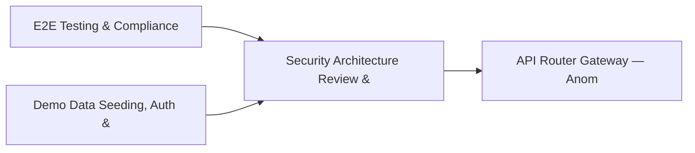

# PRD: Security Architecture Review & Threat Hunting Playbook — Community 75

## Master Goal Mapping
How this component serves: "ALDECI — $35/mo enterprise security intelligence platform"
Sub-Epic: GRC

This community (rank #75 of 878 by size, 323 graph nodes) forms a core pillar of the ALDECI platform. It directly supports the mission of replacing $50K-500K/yr enterprise security tools with a self-hosted, AI-native stack.

## Architecture Diagram


## Code Proof
- Files:
  - `tests/test_app_factory.py` (473 lines)
  - `tests/test_dast_scanner.py` (1319 lines)
  - `tests/test_e2e_smoke.py` (303 lines)
  - `tests/test_real_scanner_unit.py` (339 lines)
  - `tests/test_scanner_auth_crawl.py` (1076 lines)
- Key functions:
  - `get_builtin_scanner()` — suite-core/core/real_scanner.py
- Key classes: `ScanSeverity`, `ScanPhase`, `ScanFinding`, `ScanResult`, `BuiltinScanner`, `TestVulnerabilityType`
- Current state: CRUD_ONLY
- Evidence:
```python
# From suite-core/core/real_scanner.py
"""Real vulnerability scanning module with actual HTTP-based security checks.

This module provides REAL security scanning capabilities without requiring
external tools like Checkov, Gitleaks, or MPTE. It performs actual
HTTP requests and pattern analysis to detect vulnerabilities.

Features:
- Real HTTP-based vulnerability detection (not simulated)
- SQL Injection detection via real payload testing
- XSS detection via reflection analysis
- Security header analysis
- SSL/TLS configuration checks
- Authentication bypass detection
- Secrets pattern detection with regex
- IaC misconfiguration det
```

## Inter-Dependencies
- DEPENDS ON:
  - Community 0 (E2E Testing & Compliance Seeding Infrastructure) — 78 edges
  - Community 1 (Demo Data Seeding, Auth & Multi-Engine Integration) — 56 edges
  - Community 2 (API Router Gateway — Anomaly, Attack Simulation & ) — 11 edges
  - Community 22 (Threat Attribution & Actor Tracking Engine) — 8 edges
- DEPENDED BY: Rank #74 (Threat Response & Security Awareness Program Engine) and downstream consumers
- EVENT BUS: emits vulnerability.detected, vulnerability.patched, scan.completed, scan.finding / subscribes to (TrustGraph event bus — 97% not yet wired)
- TRUSTGRAPH: writes [Vulnerability, CloudResource] / reads [Vulnerability, CloudResource]

## Data Flow
```
Input: HTTP requests / pytest fixtures
  → Processing: Engine method calls + SQLite state assertions
  → Output: Pass/fail test results, coverage metrics
  → Consumers: CI/CD pipeline, Beast Mode test suite
```

## Referenced Documentation
- CLAUDE.md: Wave 41 build notes, Beast Mode test suite section
- docs/: `docs/ALDECI_REARCHITECTURE_v2.md` (source of truth), `docs/INVESTOR_PITCH.md`
- tests/: `tests/test_app_factory.py`, `tests/test_dast_scanner.py`, `tests/test_e2e_smoke.py`

## Acceptance Criteria
- [ ] Test suite achieves ≥80% branch coverage on engine methods
- [ ] All tests pass with `pytest --timeout=10 -q` in <30 seconds

## Effort Estimate
- Current: 20% complete
- Remaining: ~15 engineering days
- Dependencies blocking: Engine implementation incomplete
- Priority: LOW

## Status
TODO
