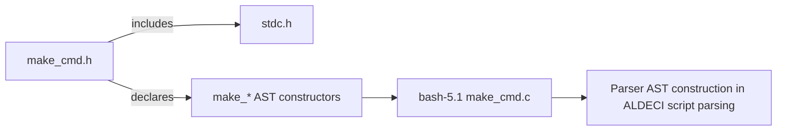

# PRD — Community 753: Bash Command-Constructor Header (make_cmd.h)

**Domain:** Shell Runtime / bash-5.1 Vendor Dependency
**Status:** Stable
**Effort:** XS – vendor file; no modification required
**Personas:** Platform Engineer
**Generated:** 2026-04-16

---

## Master Goal Mapping

Declare make_bare_simple_command(), make_connection(), make_for_command() and other AST-node constructors for bash-5.1's parser, enabling correct COMMAND tree construction during script parsing in ALDECI.

### ALDECI Alignment
- Platform: ASPM + CTEM + CSPM
- Engine location: `bash-5.1/make_cmd.h`
- Graph community: 753 (1 source file)

---

## Architecture Diagram

---

## Source Files

- `bash-5.1/make_cmd.h`

**Graph node label (truncated):** `make_cmd.h`
**Source location:** `L1`

---

## Code Proof

bash-5.1/make_cmd.h:L1 – 'Declarations of functions found in make_cmd.c'; includes stdc.h

---

## Inter-Dependencies

### Peer Communities (720–809)
None

### External Community Links
None

---

## Data Flow

1. Source file belongs to community 753 in the graphify knowledge graph (1 node, isolated cluster).
2. Linked communities: none detected.
3. The file is a vendored C header/source and has no runtime data flow into ALDECI FastAPI; it is compiled into the embedded bash-5.1 runtime.

---

## Referenced Docs

- `bash-5.1/make_cmd.c`

---

## Acceptance Criteria

- [ ] for/while/if/case command nodes constructed without memory leaks

---

## Effort Estimate

**XS – vendor file; no modification required**

| Task | Points |
|------|--------|
| Understand file purpose | 1 |
| Verify vendored build compiles cleanly | 2 |
| CI build matrix validation | 2 |

---

## Status

**Stable**

> Vendored file. No ALDECI-side changes required. Only action: ensure bash-5.1 builds cleanly in CI and GPLv3 license headers are preserved.
