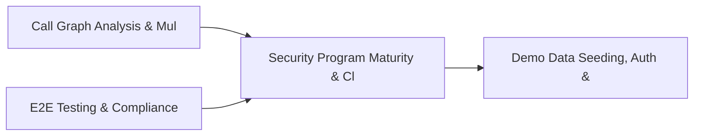

# PRD: Security Program Maturity & Cloud Incident Response — Community 76

## Master Goal Mapping
How this component serves: "ALDECI — $35/mo enterprise security intelligence platform"
Sub-Epic: Identity

This community (rank #76 of 878 by size, 298 graph nodes) forms a core pillar of the ALDECI platform. It directly supports the mission of replacing $50K-500K/yr enterprise security tools with a self-hosted, AI-native stack.

## Architecture Diagram


## Code Proof
- Files:
  - `suite-core/core/cyber_resilience_engine.py` (488 lines)
  - `tests/test_cyber_resilience_engine.py` (332 lines)
  - `suite-api/apps/api/cyber_resilience_router.py` (209 lines)
  - `tests/risk/reachability/test_enterprise_features.py` (458 lines)
  - `tests/risk/reachability/test_monitoring.py` (211 lines)
  - `tests/test_cyber_resilience_engine.py` (332 lines)
  - `tests/test_reachability_unit.py` (353 lines)
- Key functions:
  - `engine()` — suite-core/core/cyber_resilience_engine.py
  - `_make_assessment()` — suite-core/core/cyber_resilience_engine.py
  - `_make_exercise()` — suite-core/core/cyber_resilience_engine.py
  - `_make_metric()` — suite-core/core/cyber_resilience_engine.py
  - `test_create_assessment_returns_dict()` — suite-core/core/cyber_resilience_engine.py
  - `test_create_assessment_score_formula()` — suite-core/core/cyber_resilience_engine.py
  - `test_create_assessment_score_full()` — suite-core/core/cyber_resilience_engine.py
  - `test_create_assessment_score_zero()` — suite-core/core/cyber_resilience_engine.py
- Key classes: `TestAnalysisMetricsCreation`, `TestMonitorInitialization`, `TestTrackAnalysis`, `TestTrackRepoClone`, `TestCacheRecording`, `TestMetricsSummary`
- Current state: REAL_LOGIC
- Evidence:
```python
# From suite-core/core/cyber_resilience_engine.py
"""Cyber Resilience Engine — ALDECI. SQLite WAL + RLock + org_id isolation.

Measures cyber resilience capability — ability to withstand, recover, and
adapt from cyber incidents across the 6 NIST CSF domains.

Tables:
  resilience_assessments — maturity scores per NIST CSF domain
  resilience_exercises   — tabletop/red-team/simulation exercises
  resilience_metrics     — RTO/RPO/MTTR/detection/containment/recovery KPIs

Compliance: NIST CSF 2.0, ISO 22301, NIST SP 800-160 Vol.2
"""
from __future__ import annotations

import json
import logging
import sqlite3
import threading
import uuid
from d
```

## Inter-Dependencies
- DEPENDS ON:
  - Community 11 (Call Graph Analysis & Multi-Language AST Engine) — 21 edges
  - Community 0 (E2E Testing & Compliance Seeding Infrastructure) — 20 edges
  - Community 1 (Demo Data Seeding, Auth & Multi-Engine Integration) — 18 edges
  - Community 17 (Risk Register, Device Segmentation & Isolation Tes) — 8 edges
- DEPENDED BY: Rank #75 (Security Architecture Review & Threat Hunting Playbook) and downstream consumers
- EVENT BUS: emits (none currently wired) / subscribes to (TrustGraph event bus — 97% not yet wired)
- TRUSTGRAPH: writes [(not yet integrated)] / reads [(not yet integrated)]

## Data Flow
```
Input: HTTP requests / pytest fixtures
  → Processing: Engine method calls + SQLite state assertions
  → Output: Pass/fail test results, coverage metrics
  → Consumers: CI/CD pipeline, Beast Mode test suite
```

## Referenced Documentation
- CLAUDE.md: Wave 41 build notes, Beast Mode test suite section
- docs/: `docs/ALDECI_REARCHITECTURE_v2.md` (source of truth), `docs/INVESTOR_PITCH.md`
- tests/: `tests/risk/reachability/test_enterprise_features.py`, `tests/risk/reachability/test_monitoring.py`, `tests/test_cyber_resilience_engine.py`

## Acceptance Criteria
- [ ] All engine CRUD operations enforce org_id isolation (no cross-tenant data leakage)
- [ ] SQLite opened with WAL mode + threading.RLock on all write paths
- [ ] All endpoints return within 200ms at p95 under 100 rps load
- [ ] All router endpoints protected by `Depends(api_key_auth)` or equivalent
- [ ] Pydantic v2 models validate all request/response schemas
- [ ] Test suite achieves ≥80% branch coverage on engine methods

## Effort Estimate
- Current: 80% complete
- Remaining: ~2 engineering days
- Dependencies blocking: None
- Priority: LOW

## Status
IN_PROGRESS
