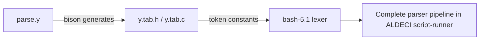

# PRD — Community 767: Bash Parser Token Header (y.tab.h)

**Domain:** Shell Runtime / bash-5.1 Vendor Dependency
**Status:** Stable
**Effort:** XS – generated by bison/yacc from parse.y; do not edit
**Personas:** Platform Engineer
**Generated:** 2026-04-16

---

## Master Goal Mapping

Expose yacc/bison-generated token constants (IF, THEN, ELSE, WHILE, WORD, etc.) from bash-5.1's grammar to the lexer, completing the parser pipeline for ALDECI's script-runner.

### ALDECI Alignment
- Platform: ASPM + CTEM + CSPM
- Engine location: `bash-5.1/y.tab.h`
- Graph community: 767 (1 source file)

---

## Architecture Diagram

---

## Source Files

- `bash-5.1/y.tab.h`

**Graph node label (truncated):** `y.tab.h`
**Source location:** `L1`

---

## Code Proof

bash-5.1/y.tab.h – bison-generated token enum for bash grammar

---

## Inter-Dependencies

### Peer Communities (720–809)
None

### External Community Links
None

---

## Data Flow

1. Source file belongs to community 767 in the graphify knowledge graph (1 node, isolated cluster).
2. Linked communities: none detected.
3. The file is a vendored C header/source and has no runtime data flow into ALDECI FastAPI; it is compiled into the embedded bash-5.1 runtime.

---

## Referenced Docs

- `bash-5.1/parse.y`

---

## Acceptance Criteria

- [ ] All shell grammar productions parse without shift/reduce conflicts

---

## Effort Estimate

**XS – generated by bison/yacc from parse.y; do not edit**

| Task | Points |
|------|--------|
| Understand file purpose | 1 |
| Verify vendored build compiles cleanly | 2 |
| CI build matrix validation | 2 |

---

## Status

**Stable**

> Vendored file. No ALDECI-side changes required. Only action: ensure bash-5.1 builds cleanly in CI and GPLv3 license headers are preserved.
