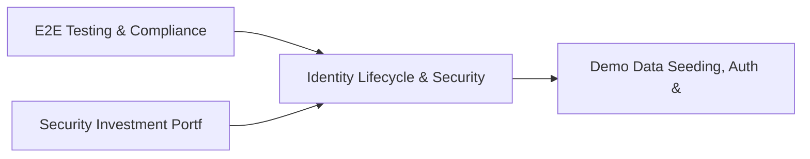

# PRD: Identity Lifecycle & Security Dependency Mapping — Community 77

## Master Goal Mapping
How this component serves: "ALDECI — $35/mo enterprise security intelligence platform"
Sub-Epic: GRC

This community (rank #77 of 878 by size, 268 graph nodes) forms a core pillar of the ALDECI platform. It directly supports the mission of replacing $50K-500K/yr enterprise security tools with a self-hosted, AI-native stack.

## Architecture Diagram


## Code Proof
- Files:
  - `tests/test_security_budget_engine.py` (387 lines)
  - `tests/test_security_investment_engine.py` (340 lines)
  - `suite-api/apps/api/security_budget_router.py` (214 lines)
  - `suite-api/apps/api/security_investment_router.py` (220 lines)
  - `suite-api/apps/api/security_metrics_router.py` (515 lines)
  - `suite-api/apps/api/security_roi_router.py` (315 lines)
  - `tests/test_security_budget_engine.py` (387 lines)
  - `tests/test_security_investment_engine.py` (340 lines)
  - `tests/test_security_roi.py` (586 lines)
- Key functions:
  - `engine()` — tests/test_security_budget_engine.py
  - `sample_investment()` — tests/test_security_budget_engine.py
  - `populated_engine()` — tests/test_security_budget_engine.py
- Key classes: `TestInvestmentCategory`, `TestInvestmentModel`, `TestROIMetricModel`, `TestAddInvestment`, `TestCalculateROI`, `TestPortfolioROI`
- Current state: REAL_LOGIC
- Evidence:
```python
# From tests/test_security_budget_engine.py
"""Tests for SecurityBudgetEngine — ALDECI.

Covers:
- Budget allocation CRUD
- All valid categories
- Invalid category validation
- Spend transaction recording (spent_amount increment)
- Approve spend workflow
- ROI assessment with calculated_roi formula
- get_budget_stats aggregations
- Org isolation
- ~35 tests
"""
from __future__ import annotations

import sys
import pytest

sys.path.insert(0, "suite-core")
sys.path.insert(0, "suite-api")
```

## Inter-Dependencies
- DEPENDS ON:
  - Community 0 (E2E Testing & Compliance Seeding Infrastructure) — 38 edges
  - Community 42 (Security Investment Portfolio & Budget Engine) — 8 edges
  - Community 1 (Demo Data Seeding, Auth & Multi-Engine Integration) — 3 edges
  - Community 25 (Cloud Workload Protection & Firmware Security) — 1 edges
- DEPENDED BY: Rank #76 (Security Program Maturity & Cloud Incident Response) and downstream consumers
- EVENT BUS: emits incident.opened, incident.closed / subscribes to (TrustGraph event bus — 97% not yet wired)
- TRUSTGRAPH: writes [Incident] / reads [Incident]

## Data Flow
```
Input: HTTP requests / pytest fixtures
  → Processing: Engine method calls + SQLite state assertions
  → Output: Pass/fail test results, coverage metrics
  → Consumers: CI/CD pipeline, Beast Mode test suite
```

## Referenced Documentation
- CLAUDE.md: Wave 41 build notes, Beast Mode test suite section
- docs/: `docs/ALDECI_REARCHITECTURE_v2.md` (source of truth), `docs/INVESTOR_PITCH.md`
- tests/: `tests/test_security_budget_engine.py`, `tests/test_security_investment_engine.py`, `tests/test_security_roi.py`

## Acceptance Criteria
- [ ] All engine CRUD operations enforce org_id isolation (no cross-tenant data leakage)
- [ ] SQLite opened with WAL mode + threading.RLock on all write paths
- [ ] All endpoints return within 200ms at p95 under 100 rps load
- [ ] All router endpoints protected by `Depends(api_key_auth)` or equivalent
- [ ] Pydantic v2 models validate all request/response schemas
- [ ] Test suite achieves ≥80% branch coverage on engine methods

## Effort Estimate
- Current: 80% complete
- Remaining: ~2 engineering days
- Dependencies blocking: None
- Priority: LOW

## Status
IN_PROGRESS
