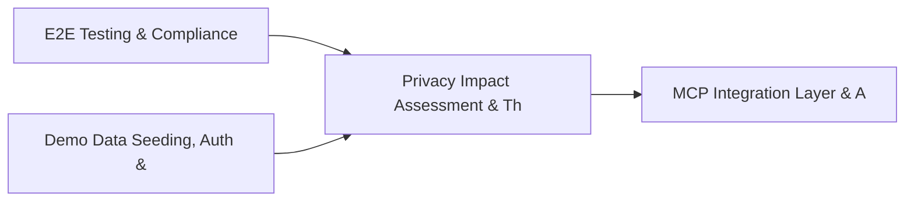

# PRD: Privacy Impact Assessment & Threat Indicator Engine — Community 78

## Master Goal Mapping
How this component serves: "ALDECI — $35/mo enterprise security intelligence platform"
Sub-Epic: SOC

This community (rank #78 of 878 by size, 261 graph nodes) forms a core pillar of the ALDECI platform. It directly supports the mission of replacing $50K-500K/yr enterprise security tools with a self-hosted, AI-native stack.

## Architecture Diagram


## Code Proof
- Files:
  - `suite-core/core/backup_engine.py` (632 lines)
  - `tests/test_backup_engine.py` (491 lines)
  - `suite-api/apps/api/backup_router.py` (155 lines)
  - `suite-api/apps/api/session_router.py` (247 lines)
  - `tests/e2e/comprehensive_e2e_test.py` (4354 lines)
  - `tests/real_world_tests/conftest.py` (147 lines)
  - `tests/risk/reachability/test_storage.py` (342 lines)
  - `tests/test_backup_engine.py` (491 lines)
  - `tests/test_session_manager.py` (598 lines)
- Key functions:
  - `engine()` — suite-core/core/backup_engine.py
  - `test_backup_status_values()` — suite-core/core/backup_engine.py
  - `test_backup_type_values()` — suite-core/core/backup_engine.py
  - `test_backup_record_fields()` — suite-core/core/backup_engine.py
  - `test_restore_record_fields()` — suite-core/core/backup_engine.py
  - `test_create_backup_no_databases()` — suite-core/core/backup_engine.py
  - `test_create_backup_with_database()` — suite-core/core/backup_engine.py
  - `test_create_backup_multiple_databases()` — suite-core/core/backup_engine.py
- Key classes: `TestSessionModel`, `TestCreateSession`, `TestValidateSession`, `TestRefreshSession`, `TestTerminateSession`
- Current state: REAL_LOGIC
- Evidence:
```python
# From suite-core/core/backup_engine.py
"""
Backup and restore engine for all SQLite databases.

Supports full, incremental, and config-only backups with scheduling,
encryption, checksum verification, and retention management.
"""
from __future__ import annotations

import hashlib
import io
import json
import logging
import os
import sqlite3
import struct
import uuid
import zipfile
from datetime import datetime, timedelta, timezone
from enum import Enum
from pathlib import Path
```

## Inter-Dependencies
- DEPENDS ON:
  - Community 0 (E2E Testing & Compliance Seeding Infrastructure) — 61 edges
  - Community 1 (Demo Data Seeding, Auth & Multi-Engine Integration) — 20 edges
  - Community 3 (MCP Integration Layer & API Key / Auth Management) — 6 edges
  - Community 15 (Network Topology Engine) — 6 edges
- DEPENDED BY: Rank #77 (Identity Lifecycle & Security Dependency Mapping) and downstream consumers
- EVENT BUS: emits (none currently wired) / subscribes to (TrustGraph event bus — 97% not yet wired)
- TRUSTGRAPH: writes [(not yet integrated)] / reads [(not yet integrated)]

## Data Flow
```
Input: HTTP requests / pytest fixtures
  → Processing: Engine method calls + SQLite state assertions
  → Output: Pass/fail test results, coverage metrics
  → Consumers: CI/CD pipeline, Beast Mode test suite
```

## Referenced Documentation
- CLAUDE.md: Wave 41 build notes, Beast Mode test suite section
- docs/: `docs/ALDECI_REARCHITECTURE_v2.md` (source of truth), `docs/INVESTOR_PITCH.md`
- tests/: `tests/e2e/comprehensive_e2e_test.py`, `tests/real_world_tests/conftest.py`, `tests/risk/reachability/test_storage.py`

## Acceptance Criteria
- [ ] All engine CRUD operations enforce org_id isolation (no cross-tenant data leakage)
- [ ] SQLite opened with WAL mode + threading.RLock on all write paths
- [ ] All endpoints return within 200ms at p95 under 100 rps load
- [ ] All router endpoints protected by `Depends(api_key_auth)` or equivalent
- [ ] Pydantic v2 models validate all request/response schemas
- [ ] Test suite achieves ≥80% branch coverage on engine methods

## Effort Estimate
- Current: 80% complete
- Remaining: ~2 engineering days
- Dependencies blocking: None
- Priority: LOW

## Status
IN_PROGRESS
