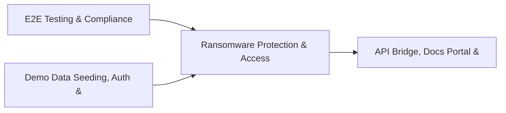

# PRD: Ransomware Protection & Access Anomaly Engine — Community 79

## Master Goal Mapping
How this component serves: "ALDECI — $35/mo enterprise security intelligence platform"
Sub-Epic: Executive

This community (rank #79 of 878 by size, 239 graph nodes) forms a core pillar of the ALDECI platform. It directly supports the mission of replacing $50K-500K/yr enterprise security tools with a self-hosted, AI-native stack.

## Architecture Diagram


## Code Proof
- Files:
  - `suite-core/core/vuln_scanner_engine.py` (526 lines)
  - `tests/test_vuln_scanner_engine.py` (274 lines)
  - `suite-api/apps/api/container_scanner_router.py` (256 lines)
  - `suite-attack/api/container_router.py` (300 lines)
  - `tests/test_sast_router_filename_sanitization.py` (66 lines)
  - `tests/test_container_scanner.py` (595 lines)
  - `tests/test_container_scanner_unit.py` (249 lines)
  - `tests/test_container_tier24_verify.py` (108 lines)
  - `tests/test_file_size_limits.py` (37 lines)
  - `tests/test_sast_router_filename_sanitization.py` (66 lines)
  - `tests/test_vuln_scanner_engine.py` (274 lines)
- Key functions:
  - `test_get_scanner_stats_empty()` — suite-core/core/vuln_scanner_engine.py
  - `test_stats_org_isolation()` — suite-core/core/vuln_scanner_engine.py
  - `test_file_size_limit_check_before_write()` — suite-core/core/vuln_scanner_engine.py
  - `test_filename_sanitization()` — suite-core/core/vuln_scanner_engine.py
  - `test_helm_chart_rules_exist()` — suite-core/core/vuln_scanner_engine.py
  - `test_layer_secret_patterns_exist()` — suite-core/core/vuln_scanner_engine.py
  - `test_helm_scan_privileged_container()` — suite-core/core/vuln_scanner_engine.py
  - `test_helm_scan_deprecated_api()` — suite-core/core/vuln_scanner_engine.py
- Key classes: `TestContainerScannerInit`, `TestDockerfileRules`, `TestKnownVulnerableImages`, `TestContainerSeverity`, `TestContainerFinding`, `TestContainerScanResult`
- Current state: REAL_LOGIC
- Evidence:
```python
# From suite-core/core/vuln_scanner_engine.py
"""Vulnerability Scanner Management Engine — ALDECI.

Manages scanner inventory, scan schedules, results, and findings
across multiple vulnerability scanners (Nessus, Qualys, OpenVAS,
Trivy, Grype, Nuclei, Nikto).

Multi-tenant via org_id. SQLite WAL for durability.
"""

from __future__ import annotations

import json
import logging
import sqlite3
import threading
import uuid
from datetime import datetime, timezone
from pathlib import Path
from typing import Any, Dict, List, Optional
```

## Inter-Dependencies
- DEPENDS ON:
  - Community 0 (E2E Testing & Compliance Seeding Infrastructure) — 31 edges
  - Community 1 (Demo Data Seeding, Auth & Multi-Engine Integration) — 12 edges
  - Community 5 (API Bridge, Docs Portal & Cross-Dashboard Infrastr) — 6 edges
  - Community 13 (MPTE — Managed Penetration Test Engine (Advanced)) — 4 edges
- DEPENDED BY: Rank #78 (Privacy Impact Assessment & Threat Indicator Engine) and downstream consumers
- EVENT BUS: emits vulnerability.detected, vulnerability.patched, user.risk_changed / subscribes to (TrustGraph event bus — 97% not yet wired)
- TRUSTGRAPH: writes [Vulnerability, Identity] / reads [Vulnerability, Identity]

## Data Flow
```
Input: HTTP requests / pytest fixtures
  → Processing: Engine method calls + SQLite state assertions
  → Output: Pass/fail test results, coverage metrics
  → Consumers: CI/CD pipeline, Beast Mode test suite
```

## Referenced Documentation
- CLAUDE.md: Wave 41 build notes, Beast Mode test suite section
- docs/: `docs/ALDECI_REARCHITECTURE_v2.md` (source of truth), `docs/INVESTOR_PITCH.md`
- tests/: `tests/test_container_scanner.py`, `tests/test_container_scanner_unit.py`, `tests/test_container_tier24_verify.py`

## Acceptance Criteria
- [ ] All engine CRUD operations enforce org_id isolation (no cross-tenant data leakage)
- [ ] SQLite opened with WAL mode + threading.RLock on all write paths
- [ ] All endpoints return within 200ms at p95 under 100 rps load
- [ ] All router endpoints protected by `Depends(api_key_auth)` or equivalent
- [ ] Pydantic v2 models validate all request/response schemas
- [ ] Test suite achieves ≥80% branch coverage on engine methods

## Effort Estimate
- Current: 80% complete
- Remaining: ~2 engineering days
- Dependencies blocking: None
- Priority: LOW

## Status
IN_PROGRESS
