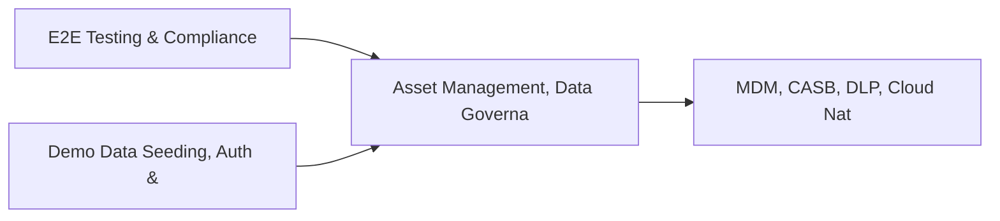

# PRD: Asset Management, Data Governance & Risk Calculator Suite — Community 8

## Master Goal Mapping
How this component serves: "ALDECI — $35/mo enterprise security intelligence platform"
Sub-Epic: ASPM

This community (rank #8 of 878 by size, 1802 graph nodes) forms a core pillar of the ALDECI platform. It directly supports the mission of replacing $50K-500K/yr enterprise security tools with a self-hosted, AI-native stack.

## Architecture Diagram


## Code Proof
- Files:
  - `scripts/full_engine_live_test.py` (879 lines)
  - `suite-api/apps/api/attack_surface_engine_router.py` (229 lines)
  - `suite-api/apps/api/ctem_engine_router.py` (311 lines)
  - `suite-core/core/asset_criticality_engine.py` (465 lines)
  - `suite-core/core/asset_lifecycle_engine.py` (490 lines)
  - `suite-core/core/attack_surface_engine.py` (598 lines)
  - `suite-core/core/operational_technology_security_engine.py` (543 lines)
  - `suite-core/core/quantum_safe_crypto_engine.py` (602 lines)
  - `suite-api/apps/api/asset_criticality_router.py` (163 lines)
  - `suite-api/apps/api/asset_inventory_router.py` (520 lines)
  - `suite-api/apps/api/asset_lifecycle_router.py` (153 lines)
  - `suite-api/apps/api/asset_risk_calculator_router.py` (164 lines)
- Key functions:
  - `test_register_asset_basic()` — scripts/full_engine_live_test.py
  - `test_register_asset_full()` — scripts/full_engine_live_test.py
  - `test_register_asset_invalid_type_defaults()` — scripts/full_engine_live_test.py
  - `test_register_asset_invalid_classification_defaults()` — scripts/full_engine_live_test.py
  - `test_list_assets_empty()` — scripts/full_engine_live_test.py
  - `test_list_assets_returns_correct_org()` — scripts/full_engine_live_test.py
  - `test_list_assets_filter_classification()` — scripts/full_engine_live_test.py
  - `test_list_assets_filter_asset_type()` — scripts/full_engine_live_test.py
- Key classes: N/A
- Current state: REAL_LOGIC
- Evidence:
```python
# From scripts/full_engine_live_test.py
#!/usr/bin/env python3
"""
full_engine_live_test.py — ALDECI Full Engine Live Test
Exercises every relevant ALDECI engine against 6 live target apps.
"""
from __future__ import annotations

import json
import sys
import time
from typing import Any, Dict, List, Optional, Tuple

import urllib.request
import urllib.error

# ---------------------------------------------------------------------------
# Config
# ---------------------------------------------------------------------------

BASE = "http://localhost:8000"
```

## Inter-Dependencies
- DEPENDS ON:
  - Community 0 (E2E Testing & Compliance Seeding Infrastructure) — 185 edges
  - Community 1 (Demo Data Seeding, Auth & Multi-Engine Integration) — 30 edges
  - Community 7 (MDM, CASB, DLP, Cloud Native & Browser Security Ro) — 20 edges
  - Community 30 (AI-Powered SOC & Deception Analytics Engine) — 18 edges
- DEPENDED BY: Rank #7 (MDM, CASB, DLP, Cloud Native & Browser Security Routers) and downstream consumers
- EVENT BUS: emits asset.registered, asset.updated, policy.violated, policy.enforced / subscribes to (TrustGraph event bus — 97% not yet wired)
- TRUSTGRAPH: writes [Vulnerability, Asset, ThreatActor] / reads [ThreatActor, Policy]

## Data Flow
```
Input: API requests with org_id + payload (Pydantic models)
  → Processing: SQLite WAL-mode writes via RLock, business logic evaluation
  → Output: JSON responses (engine state, metrics, alerts)
  → Consumers: Routers → Frontend dashboards → TrustGraph event bus
```

## Referenced Documentation
- CLAUDE.md: Wave 14 build notes, Beast Mode test suite section
- docs/: `docs/ALDECI_REARCHITECTURE_v2.md` (source of truth), `docs/INVESTOR_PITCH.md`
- tests/: N/A

## Acceptance Criteria
- [ ] All engine CRUD operations enforce org_id isolation (no cross-tenant data leakage)
- [ ] SQLite opened with WAL mode + threading.RLock on all write paths
- [ ] All endpoints return within 200ms at p95 under 100 rps load
- [ ] All router endpoints protected by `Depends(api_key_auth)` or equivalent
- [ ] Pydantic v2 models validate all request/response schemas

## Effort Estimate
- Current: 60% complete
- Remaining: ~5 engineering days
- Dependencies blocking: Frontend dashboard not yet created, Test coverage missing
- Priority: HIGH

## Status
IN_PROGRESS
