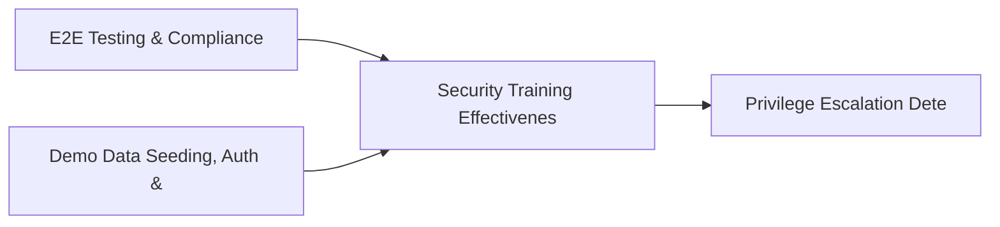

# PRD: Security Training Effectiveness & Cloud Cost Optimization — Community 80

## Master Goal Mapping
How this component serves: "ALDECI — $35/mo enterprise security intelligence platform"
Sub-Epic: AI

This community (rank #80 of 878 by size, 221 graph nodes) forms a core pillar of the ALDECI platform. It directly supports the mission of replacing $50K-500K/yr enterprise security tools with a self-hosted, AI-native stack.

## Architecture Diagram


## Code Proof
- Files:
  - `tests/test_incident_timeline_engine.py` (327 lines)
  - `suite-api/apps/api/incident_timeline_router.py` (193 lines)
  - `suite-integrations/api/ide_router.py` (982 lines)
  - `tests/test_ide_router_unit.py` (1318 lines)
  - `tests/test_ide_router_unit.py` (1318 lines)
  - `tests/test_incident_timeline_engine.py` (327 lines)
- Key functions:
  - `calculate_cyclomatic_complexity()` — tests/test_incident_timeline_engine.py
  - `calculate_cognitive_complexity()` — tests/test_incident_timeline_engine.py
  - `calculate_maintainability_index()` — tests/test_incident_timeline_engine.py
  - `count_nesting_depth()` — tests/test_incident_timeline_engine.py
  - `analyze_python_ast()` — tests/test_incident_timeline_engine.py
  - `calculate_metrics()` — tests/test_incident_timeline_engine.py
  - `find_security_issues()` — tests/test_incident_timeline_engine.py
  - `generate_suggestions()` — tests/test_incident_timeline_engine.py
- Key classes: `Severity`, `FindingCategory`, `SecurityPattern`, `IDEConfigResponse`, `CodeAnalysisRequest`, `Finding`
- Current state: REAL_LOGIC
- Evidence:
```python
# From tests/test_incident_timeline_engine.py
"""Tests for IncidentTimelineEngine — Beast Mode suite."""

from __future__ import annotations

import pytest
import tempfile
import os
from datetime import datetime, timezone, timedelta


@pytest.fixture
def engine(tmp_path):
    from core.incident_timeline_engine import IncidentTimelineEngine
    db = str(tmp_path / "test_timeline.db")
    return IncidentTimelineEngine(db_path=db)


ORG = "org-timeline-test"
ORG2 = "org-other"
```

## Inter-Dependencies
- DEPENDS ON:
  - Community 0 (E2E Testing & Compliance Seeding Infrastructure) — 12 edges
  - Community 1 (Demo Data Seeding, Auth & Multi-Engine Integration) — 11 edges
  - Community 26 (Privilege Escalation Detector & Service Account Au) — 2 edges
  - Community 47 (Access Request Management & Privileged Session Rec) — 1 edges
- DEPENDED BY: Rank #79 (Ransomware Protection & Access Anomaly Engine) and downstream consumers
- EVENT BUS: emits vulnerability.detected, vulnerability.patched / subscribes to (TrustGraph event bus — 97% not yet wired)
- TRUSTGRAPH: writes [Vulnerability, Incident] / reads [Vulnerability, Incident]

## Data Flow
```
Input: HTTP requests / pytest fixtures
  → Processing: Engine method calls + SQLite state assertions
  → Output: Pass/fail test results, coverage metrics
  → Consumers: CI/CD pipeline, Beast Mode test suite
```

## Referenced Documentation
- CLAUDE.md: Wave 41 build notes, Beast Mode test suite section
- docs/: `docs/ALDECI_REARCHITECTURE_v2.md` (source of truth), `docs/INVESTOR_PITCH.md`
- tests/: `tests/test_ide_router_unit.py`, `tests/test_incident_timeline_engine.py`

## Acceptance Criteria
- [ ] All engine CRUD operations enforce org_id isolation (no cross-tenant data leakage)
- [ ] SQLite opened with WAL mode + threading.RLock on all write paths
- [ ] All endpoints return within 200ms at p95 under 100 rps load
- [ ] All router endpoints protected by `Depends(api_key_auth)` or equivalent
- [ ] Pydantic v2 models validate all request/response schemas
- [ ] Test suite achieves ≥80% branch coverage on engine methods

## Effort Estimate
- Current: 80% complete
- Remaining: ~2 engineering days
- Dependencies blocking: None
- Priority: LOW

## Status
IN_PROGRESS
