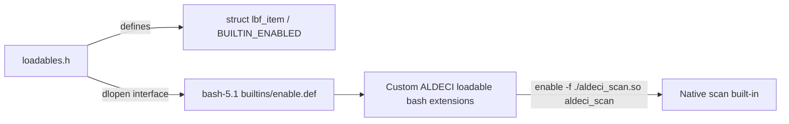

# PRD — Community 801: Bash Loadable-Extension Interface Header (loadables.h)

**Domain:** Shell Runtime / bash-5.1 Vendor Dependency
**Status:** Candidate for Extension
**Effort:** S – vendor header; ALDECI custom loadable extension possible
**Personas:** Platform Engineer, DevSecOps Engineer
**Generated:** 2026-04-16

---

## Master Goal Mapping

Define the BUILTIN_ENABLED flag, struct lbf_item, and dlopen-based extension-loading interface for bash-5.1 loadable built-ins, enabling ALDECI to package custom bash extensions (e.g. a native scan built-in) as loadable modules.

### ALDECI Alignment
- Platform: ASPM + CTEM + CSPM
- Engine location: `bash-5.1/examples/loadables/loadables.h`
- Graph community: 801 (1 source file)

---

## Architecture Diagram

---

## Source Files

- `bash-5.1/examples/loadables/loadables.h`

**Graph node label (truncated):** `loadables.h`
**Source location:** `L1`

---

## Code Proof

bash-5.1/examples/loadables/loadables.h – loadable built-in interface

---

## Inter-Dependencies

### Peer Communities (720–809)
None

### External Community Links
None

---

## Data Flow

1. Source file belongs to community 801 in the graphify knowledge graph (1 node, isolated cluster).
2. Linked communities: none detected.
3. The file is a vendored C header/source and has no runtime data flow into ALDECI FastAPI; it is compiled into the embedded bash-5.1 runtime.

---

## Referenced Docs

- `bash-5.1/builtins/enable.def`

---

## Acceptance Criteria

- [ ] enable -f ./example.so example loads custom built-in
- [ ] Custom ALDECI built-in receives WORD_LIST argument correctly

---

## Effort Estimate

**S – vendor header; ALDECI custom loadable extension possible**

| Task | Points |
|------|--------|
| Understand file purpose | 1 |
| Verify vendored build compiles cleanly | 2 |
| CI build matrix validation | 2 |

---

## Status

**Candidate for Extension**

> Vendored file. No ALDECI-side changes required. Only action: ensure bash-5.1 builds cleanly in CI and GPLv3 license headers are preserved.
