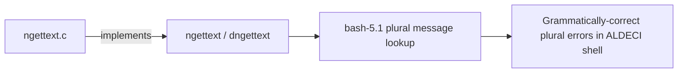

# PRD — Community 808: Bash Plural-Aware gettext Implementation (ngettext.c)

**Domain:** Shell Runtime / bash-5.1 Vendor Dependency
**Status:** Stable
**Effort:** XS – vendor file; no modification required
**Personas:** Platform Engineer
**Generated:** 2026-04-16

---

## Master Goal Mapping

Implement ngettext() for bash-5.1's bundled libintl, enabling plural-form-aware message translation in ALDECI's localised shell error output (e.g. '1 file' vs '2 files' in target locale).

### ALDECI Alignment
- Platform: ASPM + CTEM + CSPM
- Engine location: `bash-5.1/lib/intl/ngettext.c`
- Graph community: 808 (1 source file)

---

## Architecture Diagram

---

## Source Files

- `bash-5.1/lib/intl/ngettext.c`

**Graph node label (truncated):** `ngettext.c`
**Source location:** `L1`

---

## Code Proof

bash-5.1/lib/intl/ngettext.c – ngettext/dngettext implementation

---

## Inter-Dependencies

### Peer Communities (720–809)
None

### External Community Links
None

---

## Data Flow

1. Source file belongs to community 808 in the graphify knowledge graph (1 node, isolated cluster).
2. Linked communities: none detected.
3. The file is a vendored C header/source and has no runtime data flow into ALDECI FastAPI; it is compiled into the embedded bash-5.1 runtime.

---

## Referenced Docs

- `bash-5.1/lib/intl/plural-exp.h`

---

## Acceptance Criteria

- [ ] Plural forms correct for Russian, Arabic, and Slavic locales

---

## Effort Estimate

**XS – vendor file; no modification required**

| Task | Points |
|------|--------|
| Understand file purpose | 1 |
| Verify vendored build compiles cleanly | 2 |
| CI build matrix validation | 2 |

---

## Status

**Stable**

> Vendored file. No ALDECI-side changes required. Only action: ensure bash-5.1 builds cleanly in CI and GPLv3 license headers are preserved.
