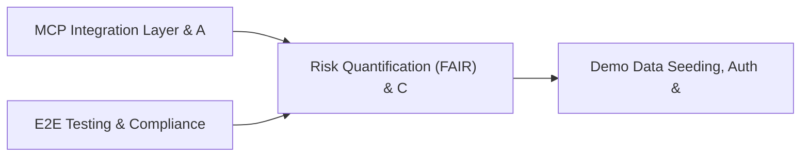

# PRD: Risk Quantification (FAIR) & Cyber Threat Modeling — Community 81

## Master Goal Mapping
How this component serves: "ALDECI — $35/mo enterprise security intelligence platform"
Sub-Epic: GRC

This community (rank #81 of 878 by size, 214 graph nodes) forms a core pillar of the ALDECI platform. It directly supports the mission of replacing $50K-500K/yr enterprise security tools with a self-hosted, AI-native stack.

## Architecture Diagram


## Code Proof
- Files:
  - `suite-api/apps/api/license_compliance_router.py` (330 lines)
  - `tests/risk/test_license_compliance.py` (448 lines)
  - `tests/test_license_compliance.py` (926 lines)
- Key functions:
  - `_comp()` — suite-api/apps/api/license_compliance_router.py
  - `engine()` — suite-api/apps/api/license_compliance_router.py
  - `commercial_policy()` — suite-api/apps/api/license_compliance_router.py
- Key classes: `TestLicenseDatabase`, `TestNormalizeLicense`, `TestCompatibilityMatrix`, `TestPolicyEngine`, `TestSBOMAudit`, `TestObligations`
- Current state: PARTIAL
- Evidence:
```python
# From suite-api/apps/api/license_compliance_router.py
"""
License Compliance API endpoints.

Provides 7 endpoints under /api/v1/licenses for open-source license
risk management: license lookup, compatibility checking, policy CRUD,
SBOM audit, obligation tracking, risk scoring, and dual-license detection.
"""
from __future__ import annotations

import uuid
from typing import Any, Dict, List, Optional

from fastapi import APIRouter, HTTPException, Query
from pydantic import BaseModel, Field

from core.license_compliance import (
    CompatibilityResult,
    ComplianceReport,
    DependencyRiskScore,
    DualLicenseInfo,
```

## Inter-Dependencies
- DEPENDS ON:
  - Community 3 (MCP Integration Layer & API Key / Auth Management) — 29 edges
  - Community 0 (E2E Testing & Compliance Seeding Infrastructure) — 13 edges
  - Community 1 (Demo Data Seeding, Auth & Multi-Engine Integration) — 8 edges
  - Community 4 (FastAPI Application Core, Feedback & Smoke Testing) — 7 edges
- DEPENDED BY: Rank #80 (Security Training Effectiveness & Cloud Cost Optimization) and downstream consumers
- EVENT BUS: emits compliance.status_changed, policy.violated, policy.enforced / subscribes to (TrustGraph event bus — 97% not yet wired)
- TRUSTGRAPH: writes [Policy, ComplianceControl, NetworkAsset] / reads [ComplianceControl, NetworkAsset]

## Data Flow
```
Input: HTTP requests / pytest fixtures
  → Processing: Engine method calls + SQLite state assertions
  → Output: Pass/fail test results, coverage metrics
  → Consumers: CI/CD pipeline, Beast Mode test suite
```

## Referenced Documentation
- CLAUDE.md: Wave 41 build notes, Beast Mode test suite section
- docs/: `docs/ALDECI_REARCHITECTURE_v2.md` (source of truth), `docs/INVESTOR_PITCH.md`
- tests/: `tests/risk/test_license_compliance.py`, `tests/test_license_compliance.py`

## Acceptance Criteria
- [ ] All router endpoints protected by `Depends(api_key_auth)` or equivalent
- [ ] Pydantic v2 models validate all request/response schemas
- [ ] Test suite achieves ≥80% branch coverage on engine methods
- [ ] All tests pass with `pytest --timeout=10 -q` in <30 seconds

## Effort Estimate
- Current: 45% complete
- Remaining: ~10 engineering days
- Dependencies blocking: Engine implementation incomplete
- Priority: LOW

## Status
IN_PROGRESS
