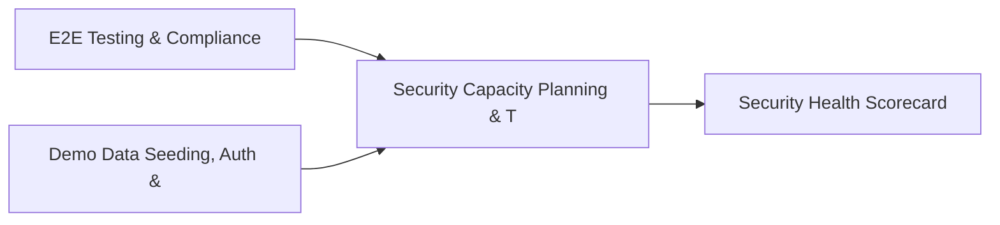

# PRD: Security Capacity Planning & TPRM Exchange Engine — Community 82

## Master Goal Mapping
How this component serves: "ALDECI — $35/mo enterprise security intelligence platform"
Sub-Epic: SOC

This community (rank #82 of 878 by size, 211 graph nodes) forms a core pillar of the ALDECI platform. It directly supports the mission of replacing $50K-500K/yr enterprise security tools with a self-hosted, AI-native stack.

## Architecture Diagram


## Code Proof
- Files:
  - `suite-api/apps/api/k8s_security_router.py` (393 lines)
  - `tests/test_k8s_security.py` (965 lines)
- Key functions:
  - `_make_pod()` — suite-api/apps/api/k8s_security_router.py
  - `_make_deployment()` — suite-api/apps/api/k8s_security_router.py
  - `_make_engine()` — suite-api/apps/api/k8s_security_router.py
  - `_minimal_config()` — suite-api/apps/api/k8s_security_router.py
- Key classes: `TestK8sModels`, `TestPodSecurityChecks`, `TestRBACAnalysis`, `TestNetworkPolicyAudit`, `TestImageSecurity`, `TestSecretsManagement`
- Current state: PARTIAL
- Evidence:
```python
# From suite-api/apps/api/k8s_security_router.py
"""Kubernetes Security Posture Management (KSPM) API Router.

Endpoints for cluster scanning, RBAC analysis, network policy audits,
image security, secrets management, and admission control for ALDECI.

Auth is applied centrally by app.py (Depends(_verify_api_key)).
"""

from __future__ import annotations

import logging
from typing import Any, Dict, List, Optional

from fastapi import APIRouter, HTTPException, Query
from pydantic import BaseModel, Field

from core.k8s_security import (
    AdmissionRule,
    CheckCategory,
    ClusterConfig,
```

## Inter-Dependencies
- DEPENDS ON:
  - Community 0 (E2E Testing & Compliance Seeding Infrastructure) — 31 edges
  - Community 1 (Demo Data Seeding, Auth & Multi-Engine Integration) — 25 edges
  - Community 44 (Security Health Scorecard & Posture History) — 5 edges
  - Community 11 (Call Graph Analysis & Multi-Language AST Engine) — 3 edges
- DEPENDED BY: Rank #81 (Risk Quantification (FAIR) & Cyber Threat Modeling) and downstream consumers
- EVENT BUS: emits policy.violated, policy.enforced / subscribes to (TrustGraph event bus — 97% not yet wired)
- TRUSTGRAPH: writes [Policy, NetworkAsset] / reads [Policy, NetworkAsset]

## Data Flow
```
Input: HTTP requests / pytest fixtures
  → Processing: Engine method calls + SQLite state assertions
  → Output: Pass/fail test results, coverage metrics
  → Consumers: CI/CD pipeline, Beast Mode test suite
```

## Referenced Documentation
- CLAUDE.md: Wave 41 build notes, Beast Mode test suite section
- docs/: `docs/ALDECI_REARCHITECTURE_v2.md` (source of truth), `docs/INVESTOR_PITCH.md`
- tests/: `tests/test_k8s_security.py`

## Acceptance Criteria
- [ ] All router endpoints protected by `Depends(api_key_auth)` or equivalent
- [ ] Pydantic v2 models validate all request/response schemas
- [ ] Test suite achieves ≥80% branch coverage on engine methods
- [ ] All tests pass with `pytest --timeout=10 -q` in <30 seconds

## Effort Estimate
- Current: 45% complete
- Remaining: ~10 engineering days
- Dependencies blocking: Engine implementation incomplete
- Priority: LOW

## Status
IN_PROGRESS
