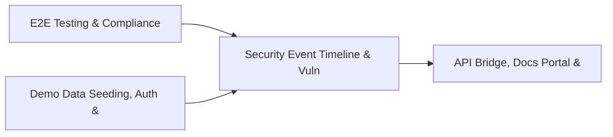

# PRD: Security Event Timeline & Vuln Intel Fusion Engine — Community 83

## Master Goal Mapping
How this component serves: "ALDECI — $35/mo enterprise security intelligence platform"
Sub-Epic: Network

This community (rank #83 of 878 by size, 202 graph nodes) forms a core pillar of the ALDECI platform. It directly supports the mission of replacing $50K-500K/yr enterprise security tools with a self-hosted, AI-native stack.

## Architecture Diagram


## Code Proof
- Files:
  - `suite-core/core/analytics_engine.py` (918 lines)
  - `tests/test_cli_scanner.py` (628 lines)
  - `tests/test_dep_scanner.py` (768 lines)
  - `tests/test_github_issues_real.py` (751 lines)
  - `tests/test_load_harness.py` (459 lines)
- Key functions:
  - `_make_results()` — suite-core/core/analytics_engine.py
  - `_make_finding()` — suite-core/core/analytics_engine.py
- Key classes: `TestRequestResultSuccess`, `TestPercentile`, `TestEndpointStats`, `TestLoadTestConfig`, `TestComputeStats`, `TestDoRequest`
- Current state: REAL_LOGIC
- Evidence:
```python
# From suite-core/core/analytics_engine.py
"""
Dashboard Analytics and Metrics Aggregation Engine — ALDECI Phase 7.

This module provides real-time dashboard analytics with:
- Time-series metric storage and querying (SQLite-backed)
- Trend analysis and percentile calculations
- Persona-specific dashboard data aggregation
- Built-in CTEM pipeline metrics (MTTD, MTTR, FP rate, connector uptime, etc.)
- Historical trend tracking

Metrics collected:
- mean_time_to_detect (MTTD) — ingestion to scoring (minutes)
- mean_time_to_remediate (MTTR) — finding to resolution (hours)
- false_positive_rate — incorrect severity decisions (%)
- findings
```

## Inter-Dependencies
- DEPENDS ON:
  - Community 0 (E2E Testing & Compliance Seeding Infrastructure) — 47 edges
  - Community 1 (Demo Data Seeding, Auth & Multi-Engine Integration) — 31 edges
  - Community 5 (API Bridge, Docs Portal & Cross-Dashboard Infrastr) — 4 edges
  - Community 2 (API Router Gateway — Anomaly, Attack Simulation & ) — 3 edges
- DEPENDED BY: Rank #82 (Security Capacity Planning & TPRM Exchange Engine) and downstream consumers
- EVENT BUS: emits scan.completed, scan.finding / subscribes to (TrustGraph event bus — 97% not yet wired)
- TRUSTGRAPH: writes [NetworkAsset] / reads [NetworkAsset]

## Data Flow
```
Input: HTTP requests / pytest fixtures
  → Processing: Engine method calls + SQLite state assertions
  → Output: Pass/fail test results, coverage metrics
  → Consumers: CI/CD pipeline, Beast Mode test suite
```

## Referenced Documentation
- CLAUDE.md: Wave 41 build notes, Beast Mode test suite section
- docs/: `docs/ALDECI_REARCHITECTURE_v2.md` (source of truth), `docs/INVESTOR_PITCH.md`
- tests/: `tests/test_cli_scanner.py`, `tests/test_dep_scanner.py`, `tests/test_github_issues_real.py`

## Acceptance Criteria
- [ ] All engine CRUD operations enforce org_id isolation (no cross-tenant data leakage)
- [ ] SQLite opened with WAL mode + threading.RLock on all write paths
- [ ] All endpoints return within 200ms at p95 under 100 rps load
- [ ] Test suite achieves ≥80% branch coverage on engine methods
- [ ] All tests pass with `pytest --timeout=10 -q` in <30 seconds

## Effort Estimate
- Current: 55% complete
- Remaining: ~5 engineering days
- Dependencies blocking: Router not yet wired to app.py
- Priority: LOW

## Status
IN_PROGRESS
