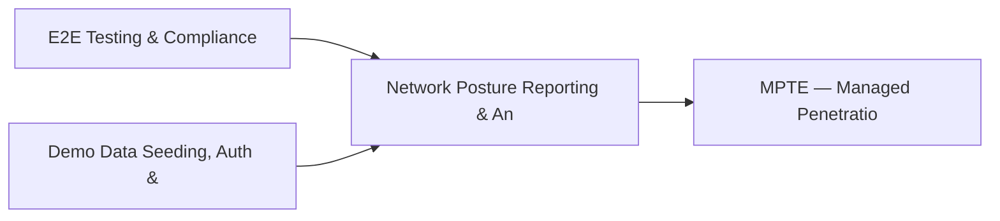

# PRD: Network Posture Reporting & Anomaly Detection — Community 84

## Master Goal Mapping
How this component serves: "ALDECI — $35/mo enterprise security intelligence platform"
Sub-Epic: Identity

This community (rank #84 of 878 by size, 198 graph nodes) forms a core pillar of the ALDECI platform. It directly supports the mission of replacing $50K-500K/yr enterprise security tools with a self-hosted, AI-native stack.

## Architecture Diagram


## Code Proof
- Files:
  - `suite-api/apps/api/backup_validator_router.py` (554 lines)
  - `tests/test_backup_validator.py` (627 lines)
- Key functions:
  - `validator()` — suite-api/apps/api/backup_validator_router.py
  - `_make_job()` — suite-api/apps/api/backup_validator_router.py
  - `_make_rpo()` — suite-api/apps/api/backup_validator_router.py
  - `_make_plan()` — suite-api/apps/api/backup_validator_router.py
  - `_make_dr_test()` — suite-api/apps/api/backup_validator_router.py
  - `_make_geo()` — suite-api/apps/api/backup_validator_router.py
  - `_make_verification()` — suite-api/apps/api/backup_validator_router.py
- Key classes: `TestBackupJobCRUD`, `TestRPOConfig`, `TestBackupVerification`, `TestDRPlan`, `TestDRTestRecord`, `TestGeoRedundancy`
- Current state: PARTIAL
- Evidence:
```python
# From suite-api/apps/api/backup_validator_router.py
"""Backup & Disaster Recovery Validator API Router.

7 endpoints under /api/v1/backup-dr:
  POST   /jobs                   — register backup job
  GET    /jobs                   — list backup jobs
  POST   /rpo                    — set RPO/RTO config
  GET    /rpo                    — list RPO/RTO configs
  POST   /verifications          — record backup verification
  GET    /verifications          — list verifications
  POST   /dr-plans               — register DR plan
  GET    /dr-plans               — list DR plans
  POST   /dr-tests               — record DR test
  GET    /dr-tests        
```

## Inter-Dependencies
- DEPENDS ON:
  - Community 0 (E2E Testing & Compliance Seeding Infrastructure) — 13 edges
  - Community 1 (Demo Data Seeding, Auth & Multi-Engine Integration) — 6 edges
  - Community 13 (MPTE — Managed Penetration Test Engine (Advanced)) — 2 edges
  - Community 44 (Security Health Scorecard & Posture History) — 1 edges
- DEPENDED BY: Rank #83 (Security Event Timeline & Vuln Intel Fusion Engine) and downstream consumers
- EVENT BUS: emits alert.created, alert.resolved, compliance.status_changed / subscribes to (TrustGraph event bus — 97% not yet wired)
- TRUSTGRAPH: writes [Alert, ComplianceControl] / reads [Alert, ComplianceControl]

## Data Flow
```
Input: HTTP requests / pytest fixtures
  → Processing: Engine method calls + SQLite state assertions
  → Output: Pass/fail test results, coverage metrics
  → Consumers: CI/CD pipeline, Beast Mode test suite
```

## Referenced Documentation
- CLAUDE.md: Wave 41 build notes, Beast Mode test suite section
- docs/: `docs/ALDECI_REARCHITECTURE_v2.md` (source of truth), `docs/INVESTOR_PITCH.md`
- tests/: `tests/test_backup_validator.py`

## Acceptance Criteria
- [ ] All router endpoints protected by `Depends(api_key_auth)` or equivalent
- [ ] Pydantic v2 models validate all request/response schemas
- [ ] Test suite achieves ≥80% branch coverage on engine methods
- [ ] All tests pass with `pytest --timeout=10 -q` in <30 seconds

## Effort Estimate
- Current: 45% complete
- Remaining: ~10 engineering days
- Dependencies blocking: Engine implementation incomplete
- Priority: LOW

## Status
IN_PROGRESS
