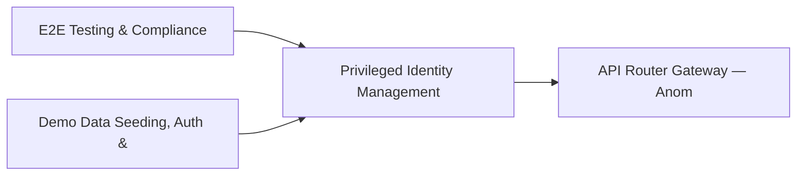

# PRD: Privileged Identity Management & Hunting Automation — Community 85

## Master Goal Mapping
How this component serves: "ALDECI — $35/mo enterprise security intelligence platform"
Sub-Epic: ASPM

This community (rank #85 of 878 by size, 184 graph nodes) forms a core pillar of the ALDECI platform. It directly supports the mission of replacing $50K-500K/yr enterprise security tools with a self-hosted, AI-native stack.

## Architecture Diagram


## Code Proof
- Files:
  - `suite-core/core/data_discovery_engine.py` (476 lines)
  - `suite-core/core/forensics_readiness_engine.py` (435 lines)
  - `tests/test_data_discovery_engine.py` (377 lines)
  - `tests/test_forensics_readiness_engine.py` (435 lines)
  - `suite-api/apps/api/data_discovery_router.py` (188 lines)
  - `suite-api/apps/api/forensics_readiness_router.py` (177 lines)
  - `suite-attack/api/vuln_discovery_router.py` (1207 lines)
  - `tests/test_data_discovery_engine.py` (377 lines)
  - `tests/test_forensics_readiness_engine.py` (435 lines)
- Key functions:
  - `engine()` — suite-core/core/data_discovery_engine.py
  - `_source()` — suite-core/core/data_discovery_engine.py
  - `_plan()` — suite-core/core/data_discovery_engine.py
  - `_full_assessment()` — suite-core/core/data_discovery_engine.py
  - `db_path()` — suite-core/core/data_discovery_engine.py
  - `engine()` — suite-core/core/data_discovery_engine.py
  - `_make_datastore()` — suite-core/core/data_discovery_engine.py
  - `_make_discovery()` — suite-core/core/data_discovery_engine.py
- Key classes: `TestRegisterEvidenceSource`, `TestListEvidenceSources`, `TestAssessReadiness`, `TestCreateCollectionPlan`, `TestExecuteCollectionPlan`, `TestCompleteCollectionPlan`
- Current state: REAL_LOGIC
- Evidence:
```python
# From suite-core/core/data_discovery_engine.py
"""Data Discovery Engine — ALDECI. SQLite WAL + RLock + org_id isolation.

Manages data store discovery and classification:
  - Datastore registration with type/risk_level validation
  - Discovery records with sensitivity tracking
  - Scan job lifecycle management
  - Aggregated stats across datastores and discovery types

Compliance: GDPR Art.30, CCPA, NIST SP 800-53 RA-2
"""
from __future__ import annotations

import logging
import sqlite3
import threading
import uuid
from datetime import datetime, timezone
from pathlib import Path
from typing import Any, Dict, List, Optional
```

## Inter-Dependencies
- DEPENDS ON:
  - Community 0 (E2E Testing & Compliance Seeding Infrastructure) — 23 edges
  - Community 1 (Demo Data Seeding, Auth & Multi-Engine Integration) — 5 edges
  - Community 2 (API Router Gateway — Anomaly, Attack Simulation & ) — 1 edges
  - Community 25 (Cloud Workload Protection & Firmware Security) — 1 edges
- DEPENDED BY: Rank #84 (Network Posture Reporting & Anomaly Detection) and downstream consumers
- EVENT BUS: emits incident.opened, incident.closed / subscribes to (TrustGraph event bus — 97% not yet wired)
- TRUSTGRAPH: writes [Vulnerability, Incident] / reads [Vulnerability, Incident]

## Data Flow
```
Input: HTTP requests / pytest fixtures
  → Processing: Engine method calls + SQLite state assertions
  → Output: Pass/fail test results, coverage metrics
  → Consumers: CI/CD pipeline, Beast Mode test suite
```

## Referenced Documentation
- CLAUDE.md: Wave 41 build notes, Beast Mode test suite section
- docs/: `docs/ALDECI_REARCHITECTURE_v2.md` (source of truth), `docs/INVESTOR_PITCH.md`
- tests/: `tests/test_data_discovery_engine.py`, `tests/test_forensics_readiness_engine.py`

## Acceptance Criteria
- [ ] All engine CRUD operations enforce org_id isolation (no cross-tenant data leakage)
- [ ] SQLite opened with WAL mode + threading.RLock on all write paths
- [ ] All endpoints return within 200ms at p95 under 100 rps load
- [ ] All router endpoints protected by `Depends(api_key_auth)` or equivalent
- [ ] Pydantic v2 models validate all request/response schemas
- [ ] Test suite achieves ≥80% branch coverage on engine methods

## Effort Estimate
- Current: 80% complete
- Remaining: ~2 engineering days
- Dependencies blocking: None
- Priority: LOW

## Status
IN_PROGRESS
