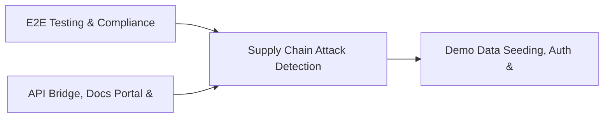

# PRD: Supply Chain Attack Detection & Monitoring Engine — Community 86

## Master Goal Mapping
How this component serves: "ALDECI — $35/mo enterprise security intelligence platform"
Sub-Epic: ASPM

This community (rank #86 of 878 by size, 164 graph nodes) forms a core pillar of the ALDECI platform. It directly supports the mission of replacing $50K-500K/yr enterprise security tools with a self-hosted, AI-native stack.

## Architecture Diagram


## Code Proof
- Files:
  - `tests/test_incident_kb_engine.py` (386 lines)
  - `suite-api/apps/api/incident_kb_router.py` (187 lines)
  - `suite-api/apps/api/security_kb_router.py` (192 lines)
  - `tests/test_incident_kb_engine.py` (386 lines)
  - `tests/test_security_kb.py` (581 lines)
- Key functions:
  - `test_create_article_basic()` — tests/test_incident_kb_engine.py
  - `test_create_article_tags_as_string()` — tests/test_incident_kb_engine.py
  - `test_create_article_tags_as_list()` — tests/test_incident_kb_engine.py
  - `test_create_article_empty_tags()` — tests/test_incident_kb_engine.py
  - `test_update_article()` — tests/test_incident_kb_engine.py
  - `test_update_article_not_found()` — tests/test_incident_kb_engine.py
  - `test_update_article_wrong_org()` — tests/test_incident_kb_engine.py
  - `test_view_article_increments()` — tests/test_incident_kb_engine.py
- Key classes: `TestArticleCRUD`, `TestVersioning`, `TestSearch`, `TestCweOwaspLookup`, `TestFindingMatching`, `TestTagListing`
- Current state: REAL_LOGIC
- Evidence:
```python
# From tests/test_incident_kb_engine.py
"""Tests for IncidentKBEngine.

Tests cover: article CRUD, view/helpful counters, search LIKE matching
(including tags), runbook creation, rolling success_rate, recommended
runbooks ordering, and KB stats.
"""

import pytest
import sys
import os

sys.path.insert(0, os.path.join(os.path.dirname(__file__), "..", "suite-core"))

from core.incident_kb_engine import IncidentKBEngine


@pytest.fixture
def engine(tmp_path):
    return IncidentKBEngine(db_path=str(tmp_path / "test.db"))
```

## Inter-Dependencies
- DEPENDS ON:
  - Community 0 (E2E Testing & Compliance Seeding Infrastructure) — 26 edges
  - Community 5 (API Bridge, Docs Portal & Cross-Dashboard Infrastr) — 8 edges
  - Community 1 (Demo Data Seeding, Auth & Multi-Engine Integration) — 2 edges
  - Community 12 (Rate Limiting, Token Bucket & Middleware Framework) — 1 edges
- DEPENDED BY: Rank #85 (Privileged Identity Management & Hunting Automation) and downstream consumers
- EVENT BUS: emits incident.opened, incident.closed / subscribes to (TrustGraph event bus — 97% not yet wired)
- TRUSTGRAPH: writes [Incident] / reads [Incident]

## Data Flow
```
Input: HTTP requests / pytest fixtures
  → Processing: Engine method calls + SQLite state assertions
  → Output: Pass/fail test results, coverage metrics
  → Consumers: CI/CD pipeline, Beast Mode test suite
```

## Referenced Documentation
- CLAUDE.md: Wave 41 build notes, Beast Mode test suite section
- docs/: `docs/ALDECI_REARCHITECTURE_v2.md` (source of truth), `docs/INVESTOR_PITCH.md`
- tests/: `tests/test_incident_kb_engine.py`, `tests/test_security_kb.py`

## Acceptance Criteria
- [ ] All engine CRUD operations enforce org_id isolation (no cross-tenant data leakage)
- [ ] SQLite opened with WAL mode + threading.RLock on all write paths
- [ ] All endpoints return within 200ms at p95 under 100 rps load
- [ ] All router endpoints protected by `Depends(api_key_auth)` or equivalent
- [ ] Pydantic v2 models validate all request/response schemas
- [ ] Test suite achieves ≥80% branch coverage on engine methods

## Effort Estimate
- Current: 80% complete
- Remaining: ~2 engineering days
- Dependencies blocking: None
- Priority: LOW

## Status
IN_PROGRESS
