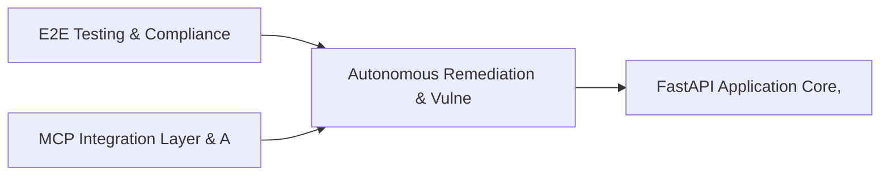

# PRD: Autonomous Remediation & Vulnerability Workflow Engine — Community 87

## Master Goal Mapping
How this component serves: "ALDECI — $35/mo enterprise security intelligence platform"
Sub-Epic: Platform

This community (rank #87 of 878 by size, 159 graph nodes) forms a core pillar of the ALDECI platform. It directly supports the mission of replacing $50K-500K/yr enterprise security tools with a self-hosted, AI-native stack.

## Architecture Diagram


## Code Proof
- Files:
  - `suite-integrations/api/webhooks_router.py` (2096 lines)
  - `tests/test_webhooks_router_outbox.py` (419 lines)
  - `tests/test_webhooks_router_unit.py` (1109 lines)
  - `tests/test_webhooks_router_outbox.py` (419 lines)
  - `tests/test_webhooks_router_unit.py` (1109 lines)
- Key functions:
  - `_verify_jira_signature()` — suite-integrations/api/webhooks_router.py
  - `_map_jira_status_to_fixops()` — suite-integrations/api/webhooks_router.py
  - `_map_servicenow_state_to_fixops()` — suite-integrations/api/webhooks_router.py
  - `_get_connector_settings()` — suite-integrations/api/webhooks_router.py
  - `_map_gitlab_state_to_fixops()` — suite-integrations/api/webhooks_router.py
  - `_map_gitlab_labels_to_status()` — suite-integrations/api/webhooks_router.py
  - `_map_azure_state_to_fixops()` — suite-integrations/api/webhooks_router.py
  - `isolated_db()` — suite-integrations/api/webhooks_router.py
- Key classes: `JiraWebhookPayload`, `ServiceNowWebhookPayload`, `CreateMappingRequest`, `DriftResolutionRequest`, `OutboxRequest`, `GitLabWebhookPayload`
- Current state: PARTIAL
- Evidence:
```python
# From suite-integrations/api/webhooks_router.py
"""Webhook receivers for bidirectional integration sync.

This module exports two routers:
- router: Management endpoints (mappings, drift, outbox) - requires API key authentication
- receiver_router: Webhook receiver endpoints (jira, servicenow, gitlab, azure) - uses signature verification only

External services (Jira, ServiceNow, GitLab, Azure DevOps) cannot provide FixOps API keys,
so receiver endpoints use their own authentication mechanisms (webhook signatures).
"""

import hashlib
import hmac
import ipaddress
import json
import logging
import os
import sqlite3
import uuid
from datetime 
```

## Inter-Dependencies
- DEPENDS ON:
  - Community 0 (E2E Testing & Compliance Seeding Infrastructure) — 59 edges
  - Community 3 (MCP Integration Layer & API Key / Auth Management) — 16 edges
  - Community 4 (FastAPI Application Core, Feedback & Smoke Testing) — 7 edges
  - Community 9 (Integrations Hub — Connectors, Bulk Operations & M) — 7 edges
- DEPENDED BY: Rank #86 (Supply Chain Attack Detection & Monitoring Engine) and downstream consumers
- EVENT BUS: emits (none currently wired) / subscribes to (TrustGraph event bus — 97% not yet wired)
- TRUSTGRAPH: writes [(not yet integrated)] / reads [(not yet integrated)]

## Data Flow
```
Input: HTTP requests / pytest fixtures
  → Processing: Engine method calls + SQLite state assertions
  → Output: Pass/fail test results, coverage metrics
  → Consumers: CI/CD pipeline, Beast Mode test suite
```

## Referenced Documentation
- CLAUDE.md: Wave 41 build notes, Beast Mode test suite section
- docs/: `docs/ALDECI_REARCHITECTURE_v2.md` (source of truth), `docs/INVESTOR_PITCH.md`
- tests/: `tests/test_webhooks_router_outbox.py`, `tests/test_webhooks_router_unit.py`

## Acceptance Criteria
- [ ] All router endpoints protected by `Depends(api_key_auth)` or equivalent
- [ ] Pydantic v2 models validate all request/response schemas
- [ ] Test suite achieves ≥80% branch coverage on engine methods
- [ ] All tests pass with `pytest --timeout=10 -q` in <30 seconds

## Effort Estimate
- Current: 45% complete
- Remaining: ~10 engineering days
- Dependencies blocking: Engine implementation incomplete
- Priority: LOW

## Status
IN_PROGRESS
