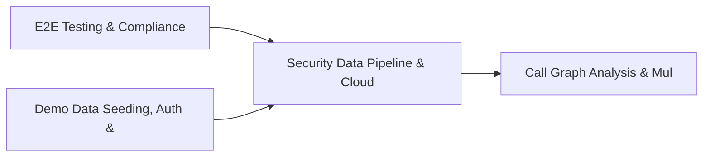

# PRD: Security Data Pipeline & Cloud Access Security Engine — Community 88

## Master Goal Mapping
How this component serves: "ALDECI — $35/mo enterprise security intelligence platform"
Sub-Epic: Executive

This community (rank #88 of 878 by size, 145 graph nodes) forms a core pillar of the ALDECI platform. It directly supports the mission of replacing $50K-500K/yr enterprise security tools with a self-hosted, AI-native stack.

## Architecture Diagram


## Code Proof
- Files:
  - `suite-api/apps/api/data_classification_router.py` (215 lines)
  - `tests/test_data_classification.py` (671 lines)
- Key functions:
  - `engine()` — suite-api/apps/api/data_classification_router.py
  - `sample_asset()` — suite-api/apps/api/data_classification_router.py
- Key classes: `TestClassificationLevel`, `TestDataCategory`, `TestClassifiedAsset`, `TestClassifyAsset`, `TestAutoClassifyPII`, `TestAutoClassifyPHI`
- Current state: PARTIAL
- Evidence:
```python
# From suite-api/apps/api/data_classification_router.py
"""Data Classification API Router — SCIF-grade asset classification endpoints.

Endpoints:
    POST   /api/v1/classification/assets              -- Classify an asset
    GET    /api/v1/classification/assets              -- List classified assets
    GET    /api/v1/classification/assets/{asset_id}   -- Get asset classification
    POST   /api/v1/classification/assets/{asset_id}/auto-classify  -- Auto-classify by content
    POST   /api/v1/classification/assets/{asset_id}/upgrade        -- Upgrade classification
    POST   /api/v1/classification/assets/{asset_id}/downgrade      -- Downgrade (wit
```

## Inter-Dependencies
- DEPENDS ON:
  - Community 0 (E2E Testing & Compliance Seeding Infrastructure) — 19 edges
  - Community 1 (Demo Data Seeding, Auth & Multi-Engine Integration) — 4 edges
  - Community 11 (Call Graph Analysis & Multi-Language AST Engine) — 1 edges
- DEPENDED BY: Rank #87 (Autonomous Remediation & Vulnerability Workflow Engine) and downstream consumers
- EVENT BUS: emits asset.registered, asset.updated / subscribes to (TrustGraph event bus — 97% not yet wired)
- TRUSTGRAPH: writes [Asset] / reads [Asset]

## Data Flow
```
Input: HTTP requests / pytest fixtures
  → Processing: Engine method calls + SQLite state assertions
  → Output: Pass/fail test results, coverage metrics
  → Consumers: CI/CD pipeline, Beast Mode test suite
```

## Referenced Documentation
- CLAUDE.md: Wave 41 build notes, Beast Mode test suite section
- docs/: `docs/ALDECI_REARCHITECTURE_v2.md` (source of truth), `docs/INVESTOR_PITCH.md`
- tests/: `tests/test_data_classification.py`

## Acceptance Criteria
- [ ] All router endpoints protected by `Depends(api_key_auth)` or equivalent
- [ ] Pydantic v2 models validate all request/response schemas
- [ ] Test suite achieves ≥80% branch coverage on engine methods
- [ ] All tests pass with `pytest --timeout=10 -q` in <30 seconds

## Effort Estimate
- Current: 45% complete
- Remaining: ~10 engineering days
- Dependencies blocking: Engine implementation incomplete
- Priority: LOW

## Status
IN_PROGRESS
