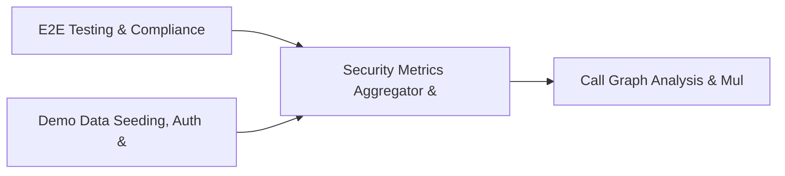

# PRD: Security Metrics Aggregator & Endpoint Threat Hunting — Community 89

## Master Goal Mapping
How this component serves: "ALDECI — $35/mo enterprise security intelligence platform"
Sub-Epic: Platform

This community (rank #89 of 878 by size, 140 graph nodes) forms a core pillar of the ALDECI platform. It directly supports the mission of replacing $50K-500K/yr enterprise security tools with a self-hosted, AI-native stack.

## Architecture Diagram


## Code Proof
- Files:
  - `suite-api/apps/api/tenant_router.py` (196 lines)
  - `tests/test_tenant_isolation.py` (451 lines)
- Key functions:
  - `clear_tenant_context()` — suite-api/apps/api/tenant_router.py
  - `data_root()` — suite-api/apps/api/tenant_router.py
  - `test_middleware_sets_tenant_context()` — suite-api/apps/api/tenant_router.py
  - `test_middleware_clears_tenant_context_after_response()` — suite-api/apps/api/tenant_router.py
  - `_data_root()` — suite-api/apps/api/tenant_router.py
  - `set()` — suite-api/apps/api/tenant_router.py
  - `get()` — suite-api/apps/api/tenant_router.py
  - `clear()` — suite-api/apps/api/tenant_router.py
- Key classes: `TestTenantContext`, `TestModuleFunctions`, `TestTenantScopedDb`, `TestEnsureTenantDirectory`, `TestValidateTenantAccess`, `TestListTenants`
- Current state: PARTIAL
- Evidence:
```python
# From suite-api/apps/api/tenant_router.py
"""Tenant management API router.

Provides admin-level endpoints for multi-tenant data management:

    GET    /api/v1/tenants              — list all org directories (admin only)
    GET    /api/v1/tenants/current      — current request tenant info
    GET    /api/v1/tenants/{org_id}/stats — statistics for a specific tenant
    DELETE /api/v1/tenants/{org_id}     — delete all tenant data (admin only)

Security:
    All endpoints require API key authentication via ``_verify_api_key``.
    Destructive operations (DELETE) are additionally gated by admin scope.

Usage::

    # In app.py (already 
```

## Inter-Dependencies
- DEPENDS ON:
  - Community 0 (E2E Testing & Compliance Seeding Infrastructure) — 22 edges
  - Community 1 (Demo Data Seeding, Auth & Multi-Engine Integration) — 10 edges
  - Community 11 (Call Graph Analysis & Multi-Language AST Engine) — 5 edges
  - Community 4 (FastAPI Application Core, Feedback & Smoke Testing) — 3 edges
- DEPENDED BY: Rank #88 (Security Data Pipeline & Cloud Access Security Engine) and downstream consumers
- EVENT BUS: emits (none currently wired) / subscribes to (TrustGraph event bus — 97% not yet wired)
- TRUSTGRAPH: writes [(not yet integrated)] / reads [(not yet integrated)]

## Data Flow
```
Input: HTTP requests / pytest fixtures
  → Processing: Engine method calls + SQLite state assertions
  → Output: Pass/fail test results, coverage metrics
  → Consumers: CI/CD pipeline, Beast Mode test suite
```

## Referenced Documentation
- CLAUDE.md: Wave 41 build notes, Beast Mode test suite section
- docs/: `docs/ALDECI_REARCHITECTURE_v2.md` (source of truth), `docs/INVESTOR_PITCH.md`
- tests/: `tests/test_tenant_isolation.py`

## Acceptance Criteria
- [ ] All router endpoints protected by `Depends(api_key_auth)` or equivalent
- [ ] Pydantic v2 models validate all request/response schemas
- [ ] Test suite achieves ≥80% branch coverage on engine methods
- [ ] All tests pass with `pytest --timeout=10 -q` in <30 seconds

## Effort Estimate
- Current: 45% complete
- Remaining: ~10 engineering days
- Dependencies blocking: Engine implementation incomplete
- Priority: LOW

## Status
IN_PROGRESS
