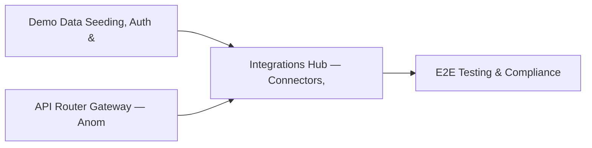

# PRD: Integrations Hub — Connectors, Bulk Operations & MCP Gateway — Community 9

## Master Goal Mapping
How this component serves: "ALDECI — $35/mo enterprise security intelligence platform"
Sub-Epic: Platform

This community (rank #9 of 878 by size, 1742 graph nodes) forms a core pillar of the ALDECI platform. It directly supports the mission of replacing $50K-500K/yr enterprise security tools with a self-hosted, AI-native stack.

## Architecture Diagram


## Code Proof
- Files:
  - `suite-core/core/remediation_engine.py` (1177 lines)
  - `suite-api/apps/api/bulk_router.py` (1297 lines)
  - `suite-api/apps/api/connectors_router.py` (385 lines)
  - `suite-api/apps/api/github_issues_router.py` (417 lines)
  - `suite-api/apps/api/mcp_gateway_router.py` (200 lines)
  - `suite-api/apps/api/vuln_enricher_router.py` (160 lines)
  - `suite-core/api/deduplication_router.py` (500 lines)
  - `suite-core/connectors/trustgraph_core_router.py` (930 lines)
- Key functions:
  - `integrations_status()` — suite-core/core/remediation_engine.py
  - `list_integrations()` — suite-core/core/remediation_engine.py
  - `create_integration()` — suite-core/core/remediation_engine.py
  - `get_integration()` — suite-core/core/remediation_engine.py
  - `update_integration()` — suite-core/core/remediation_engine.py
  - `delete_integration()` — suite-core/core/remediation_engine.py
  - `test_integration()` — suite-core/core/remediation_engine.py
  - `get_sync_status()` — suite-core/core/remediation_engine.py
- Key classes: `IntegrationCreate`, `IntegrationUpdate`, `IntegrationResponse`, `PaginatedIntegrationResponse`, `TestDeduplicationService`, `TestSnykConnector`
- Current state: REAL_LOGIC
- Evidence:
```python
# From suite-core/core/remediation_engine.py
"""
FixEngine — Automated Remediation Workflow Engine.

Provides playbook-driven remediation with:
- 8 playbook types (patch, rotate secret, block IP, etc.)
- Step-by-step execution tracking
- Approval gates with approve/reject flows
- Auto-rollback on failure
- SQLite-backed persistence
- Built-in templates for common remediation patterns

Compliance: SOC2 CC7.2, NIST CSF RS.MI
"""

from __future__ import annotations

import json
import logging
import sqlite3
import time
```

## Inter-Dependencies
- DEPENDS ON:
  - Community 1 (Demo Data Seeding, Auth & Multi-Engine Integration) — 403 edges
  - Community 2 (API Router Gateway — Anomaly, Attack Simulation & ) — 357 edges
  - Community 0 (E2E Testing & Compliance Seeding Infrastructure) — 199 edges
  - Community 3 (MCP Integration Layer & API Key / Auth Management) — 140 edges
- DEPENDED BY: Rank #8 (Asset Management, Data Governance & Risk Calculator Suite) and downstream consumers
- EVENT BUS: emits alert.created, alert.resolved / subscribes to (TrustGraph event bus — 97% not yet wired)
- TRUSTGRAPH: writes [Vulnerability, Alert, Policy] / reads [Alert, Policy]

## Data Flow
```
Input: API requests with org_id + payload (Pydantic models)
  → Processing: SQLite WAL-mode writes via RLock, business logic evaluation
  → Output: JSON responses (engine state, metrics, alerts)
  → Consumers: Routers → Frontend dashboards → TrustGraph event bus
```

## Referenced Documentation
- CLAUDE.md: Wave 15 build notes, Beast Mode test suite section
- docs/: `docs/ALDECI_REARCHITECTURE_v2.md` (source of truth), `docs/INVESTOR_PITCH.md`
- tests/: N/A

## Acceptance Criteria
- [ ] All engine CRUD operations enforce org_id isolation (no cross-tenant data leakage)
- [ ] SQLite opened with WAL mode + threading.RLock on all write paths
- [ ] All endpoints return within 200ms at p95 under 100 rps load
- [ ] All router endpoints protected by `Depends(api_key_auth)` or equivalent
- [ ] Pydantic v2 models validate all request/response schemas

## Effort Estimate
- Current: 60% complete
- Remaining: ~5 engineering days
- Dependencies blocking: Frontend dashboard not yet created, Test coverage missing
- Priority: HIGH

## Status
IN_PROGRESS
