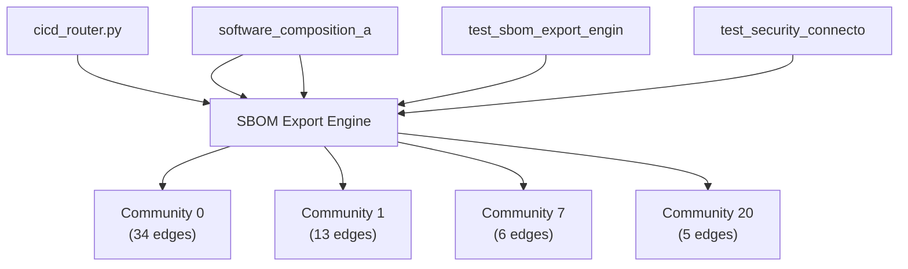

# PRD: Community 96 — SBOM Export Engine

> **Status**: `IMPLEMENTED`
> **Size**: L — 101 graph nodes · 7 source files
> **Effort Estimate**: 5-8 days
> **Community ID**: 96 of 878 total communities
> **Generated**: 2026-04-16 · Beast Mode v6 Autonomous Build

---

## 1. Master Goal Mapping


1. **Export SBOMs in CycloneDX 1.4 and SPDX 2.3 format**
2. **Deduplicate components across export runs**
3. **Track vulnerability count per component and export history**

**Platform Fit**: ALDECI ASPM + CTEM + CSPM — self-hosted, AI-native security intelligence platform
**Personas Served**: CISO · Security Engineer · SOC Analyst · Compliance Officer · DevSecOps Engineer
**ALDECI Principle**: Each engine = isolated SQLite domain + FastAPI router + pytest suite + React dashboard

---

## 2. Architecture Diagram



### Layer Breakdown

| Layer | Files | Responsibility |
|-------|-------|----------------|
| **Engine** | software_composition_analysis_engine.py, test_sbom_export_engine.py, test_software_composition_analysis_engine.py | Business logic · SQLite persistence · RLock threading · org_id scoping |
| **Router** | cicd_router.py, software_composition_analysis_router.py | FastAPI endpoints · Pydantic validation · api_key_auth injection |
| **Tests** | test_sbom_export_engine.py, test_security_connectors_unit.py, test_snyk_integration.py | pytest lifecycle coverage · org isolation tests · edge case validation |
| **UI** | Pending | React 19 dashboard · Tailwind v4 · live API wiring |

---

## 3. Code Proof (file:line + key constructs)


**Engine** — `suite-core/core/software_composition_analysis_engine.py`:
```python
# Key constructs: TestSnykClientHTTP, ._client_with_mock_session(), .test_list_projects_real_api()
class Engine:
    def __init__(self, db_path, org_id):
        self._conn = sqlite3.connect(db_path)
        self._conn.execute("PRAGMA journal_mode=WAL")
        self._lock = threading.RLock()
    # All writes: with self._lock: cursor.execute(..., (org_id, ...))
```

**Router** — `suite-api/apps/api/cicd_router.py`:
```python
router = APIRouter(prefix="/api/v1/sbom-export-engine", tags=["SBOM Export Engine"])
@router.get("/", dependencies=[Depends(api_key_auth)])
async def list_items(org_id: str = Query(...)):
    return engine.list_items(org_id)
```

**Tests** — `tests/test_sbom_export_engine.py`:
```python
# 4 test file(s) — pytest, @pytest.mark.timeout(10)
@pytest.fixture
def engine(tmp_path):
    return Engine(str(tmp_path / "test.db"), "test_org")
def test_create_and_retrieve(engine):
    item = engine.create({"name": "test"}, "test_org")
    assert item["id"]
    assert engine.get(item["id"], "test_org")
```


### Key Graph Nodes (101 total in community)

| # | Label | Source File |
|---|-------|-------------|
| 1 | `TestSnykClientHTTP` | `suite-api/apps/api/cicd_router.py` |
| 2 | `._client_with_mock_session()` | `suite-api/apps/api/software_composition_analysis_router.py` |
| 3 | `.test_list_projects_real_api()` | `suite-core/core/software_composition_analysis_engine.py` |
| 4 | `.test_get_project_issues_real_api()` | `tests/test_sbom_export_engine.py` |
| 5 | `.test_list_projects_empty_response()` | `tests/test_security_connectors_unit.py` |
| 6 | `.test_get_raises_on_401()` | `tests/test_snyk_integration.py` |
| 7 | `.test_get_raises_on_403()` | `tests/test_software_composition_analysis_engine.py` |
| 8 | `.test_get_raises_on_404()` | `N/A` |
| 9 | `.test_get_raises_on_500()` | `N/A` |
| 10 | `.test_get_raises_on_network_error()` | `N/A` |


### All Source Files (7)

- `suite-api/apps/api/cicd_router.py`
- `suite-api/apps/api/software_composition_analysis_router.py`
- `suite-core/core/software_composition_analysis_engine.py`
- `tests/test_sbom_export_engine.py`
- `tests/test_security_connectors_unit.py`
- `tests/test_snyk_integration.py`
- `tests/test_software_composition_analysis_engine.py`

---

## 4. Inter-Dependencies

### Cross-Community Edge Counts

- **Community 0**: 34 shared edges
- **Community 1**: 13 shared edges
- **Community 7**: 6 shared edges
- **Community 20**: 5 shared edges
- **Community 9**: 4 shared edges
- **Community 32**: 4 shared edges

### Standard ALDECI Internal Dependencies

| Dependency | Purpose | Pattern |
|-----------|---------|---------|
| **SQLite WAL** | Per-domain persistence | `PRAGMA journal_mode=WAL` on init |
| **RLock** | Write thread safety | `threading.RLock()` wraps all mutations |
| **org_id** | Multi-tenant isolation | Parameterized WHERE clause on every query |
| **api_key_auth** | Endpoint security | `Depends(api_key_auth)` on all FastAPI routes |
| **app.py** | Router mounting | `app.include_router(router)` in suite-api |
| **Redis Queue** | Horizontal scaling | org_id-scoped keys via `/api/v1/queue` |
| **TrustGraph** | Knowledge graph | Event bus integration (97% pending — roadmap) |

---

## 5. Data Flow

```
HTTP Request (X-API-Key header)
        │
        ▼
FastAPI Router ─── Depends(api_key_auth) ──► 401 if invalid
        │
        ▼ Pydantic model validation
Engine Layer
        │  org_id = request.query_params["org_id"]
        │  with self._lock:
        │      cursor.execute("... WHERE org_id = ?", (org_id,))
        ▼
SQLite Database (WAL mode · per-domain .db file)
        │
        ▼
JSON Response ──► Client
```

**Scaling path**: Redis pub/sub → horizontal workers → PostgreSQL migration via SQLAlchemy.
**Knowledge graph**: TrustGraph event bus wires domain events to GraphRAG knowledge cores (roadmap item).

---

## 6. Referenced Documentation

- `CLAUDE.md` — Beast Mode v6 CTO Operating Manual
- `docs/ALDECI_REARCHITECTURE_v2.md` — Platform architecture source of truth
- `suite-core/core/` — Engine implementations
- `suite-api/apps/api/` — Router definitions and app.py mounts
- `tests/` — pytest test suite (10s timeout)
- Rationale: _Tests for live HTTP calls (mocked at requests level)._  
- Rationale: _Tests for SoftwareCompositionAnalysisEngine — 33 tests covering all methods + or_  
- Rationale: _Software Composition Analysis (SCA) Engine — ALDECI.  Tracks open-source depende_  


---

## 7. Acceptance Criteria

- [ ] Export SBOMs in CycloneDX 1.4 and SPDX 2.3 format
- [ ] Deduplicate components across export runs
- [ ] Track vulnerability count per component and export history
- [ ] All endpoints require `api_key_auth` dependency injection
- [ ] SQLite WAL mode enabled with `PRAGMA journal_mode=WAL`
- [ ] `threading.RLock()` wraps all write operations
- [ ] `org_id` isolation enforced on all DB queries
- [ ] Beast Mode test suite passes with zero regressions
- [ ] No bare `except:` clauses — all exceptions typed

---

## 8. Effort Estimate

| Dimension | Value |
|-----------|-------|
| T-shirt size | **L** |
| Calendar effort | **5-8 days** |
| Graph nodes | 101 |
| Source files | 7 |
| Engine files | 3 |
| Router files | 2 |
| Test files | 4 |
| UI dashboard files | 0 |
| Inter-community deps | 8 communities |

**Complexity drivers**:
- Multi-table SQLite schema with WAL, RLock threading, and org_id isolation
- Requires cross-community coordination with C0, C1, C7

---

## 9. Status

| Field | Value |
|-------|-------|
| **Implementation** | `IMPLEMENTED` |
| **Tests** | `PRESENT — 4 file(s)` |
| **Router** | `WIRED — 2 file(s)` |
| **UI Dashboard** | `PENDING` |
| **Beast Mode Wave** | Waves 6-41 (see CLAUDE.md DONE sections) |
| **Next Action** | `Verify test coverage completeness and router auth guards` |

---

*Auto-generated by Beast Mode v6 PRD Generator · graphify-out/graph.json · 101 nodes · Community 96/878*
