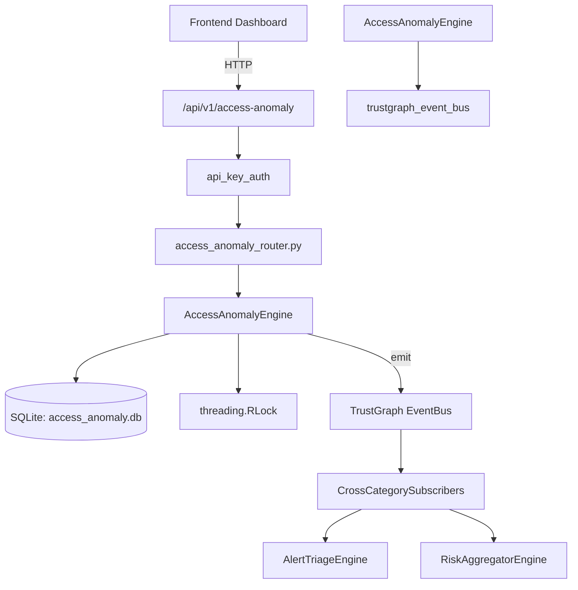

# US-0001: Access Anomaly

## Sub-Epic: Identity
**Master Goal**: ALDECI — $35/mo enterprise security intelligence platform replacing $50K-500K/yr tools

## User Story
As a **Robert Kim (Compliance Officer)**, I need to enforce access policies for SOC2/NIST compliance
so that the platform delivers enterprise-grade identity capabilities at 1/1000th the cost of legacy tools.

## Why This Matters
Access Anomaly replaces functionality found in enterprise tools like CrowdStrike, Wiz, Snyk, and Rapid7.
By building this into ALDECI's $35/mo stack, customers save $50K+/yr on standalone Identity tooling.

## Architecture

## Current State: 95% Complete
- ✅ `record_event()` — Record an access event with default risk_score=0 and anomaly_flags=[]. (line 153)
- ✅ `upsert_baseline()` — Insert or replace user baseline. (line 207)
- ✅ `detect_anomalies()` — Check event against baseline and create anomaly records. (line 273)
- ✅ `detect_impossible_travel()` — Detect impossible travel: same user, different country, within hours_window. (line 384)
- ✅ `resolve_anomaly()` — Set anomaly status=resolved and resolved_at=now. (line 432)
- ✅ `list_anomalies()` — implemented (line 449)
- ❌ TrustGraph event emission — not yet verified

## Key Functions (from `suite-core/core/access_anomaly_engine.py` — 583 lines)
- `AccessAnomalyEngine.record_event()` — Record an access event with default risk_score=0 and anomaly_flags=[]. (line 153)
- `AccessAnomalyEngine.upsert_baseline()` — Insert or replace user baseline. (line 207)
- `AccessAnomalyEngine.detect_anomalies()` — Check event against baseline and create anomaly records. (line 273)
- `AccessAnomalyEngine.detect_impossible_travel()` — Detect impossible travel: same user, different country, within hours_window. (line 384)
- `AccessAnomalyEngine.resolve_anomaly()` — Set anomaly status=resolved and resolved_at=now. (line 432)
- `AccessAnomalyEngine.list_anomalies()` — Handle list anomalies (line 449)
- `AccessAnomalyEngine.get_user_risk_profile()` — Baseline + open anomalies + recent 50 events + avg risk_score. (line 477)
- `AccessAnomalyEngine.get_high_risk_users()` — Users with >= min_anomaly_count open anomalies, ordered by count DESC. (line 520)

## Dependencies
- **Depends on**: trustgraph_event_bus
- **Depended by**: Routers, TrustGraph EventBus, CrossCategorySubscribers
- **TrustGraph**: Event emission wired via ResponseInterceptorMiddleware
- **Source file**: `suite-core/core/access_anomaly_engine.py` (583 lines)
- **Router file**: `suite-api/apps/api/access_anomaly_router.py`

## API Endpoints
| Method | Path | Description |
|--------|------|-------------|
| POST | `/api/v1/access-anomaly/events` | record event |
| POST | `/api/v1/access-anomaly/events/{event_id}/detect-anomalies` | detect anomalies |
| POST | `/api/v1/access-anomaly/baseline` | upsert baseline |
| POST | `/api/v1/access-anomaly/impossible-travel/{username}` | detect impossible travel |
| POST | `/api/v1/access-anomaly/anomalies/{anomaly_id}/resolve` | resolve anomaly |
| GET | `/api/v1/access-anomaly/anomalies` | list anomalies |
| GET | `/api/v1/access-anomaly/users/{username}/profile` | get user risk profile |
| GET | `/api/v1/access-anomaly/high-risk-users` | get high risk users |
| GET | `/api/v1/access-anomaly/summary` | get summary |

## Tasks Remaining
1. Verify TrustGraph event emission works end-to-end (2h)
2. Add integration test with real persona workflow (2h)
3. Wire CrossCategorySubscriber consumer chain (1h)
4. Validate with 30-persona walkthrough (1h)
5. Optimize query performance for large datasets (2h)
6. Expand test coverage to edge cases (2h)

## Definition of Done
- [ ] Robert Kim (Compliance Officer) can access /api/v1/access-anomaly and get meaningful data
- [ ] All CRUD operations return correct HTTP status codes
- [ ] TrustGraph receives events from this engine
- [ ] 45+ tests passing in `tests/test_access_anomaly_engine.py`
- [ ] 30-persona walkthrough includes this endpoint at 100%
- [ ] No hardcoded org_id — all queries are org-scoped

## Sprint: Wave 42 (est. April 18-20, 2026)

## Test Coverage
- **Test file**: `tests/test_access_anomaly_engine.py`
- **Tests**: 45 tests
- **Status**: Passing
