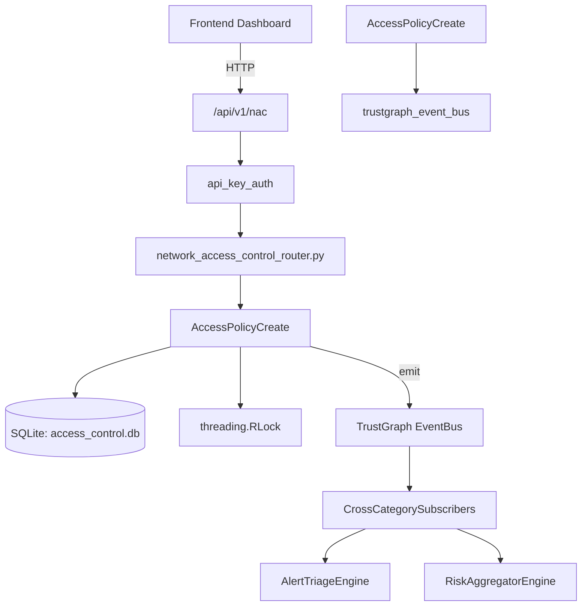

# US-0002: Access Control

## Sub-Epic: Identity
**Master Goal**: ALDECI — $35/mo enterprise security intelligence platform replacing $50K-500K/yr tools

## User Story
As a **Robert Kim (Compliance Officer)**, I need to enforce access policies for SOC2/NIST compliance
so that the platform delivers enterprise-grade identity capabilities at 1/1000th the cost of legacy tools.

## Why This Matters
Access Control replaces functionality found in enterprise tools like CrowdStrike, Wiz, Snyk, and Rapid7.
By building this into ALDECI's $35/mo stack, customers save $50K+/yr on standalone Identity tooling.

## Architecture

## Current State: 95% Complete
- ✅ `create_access_policy()` — Create a new access policy. Returns the policy record. (line 140)
- ✅ `list_access_policies()` — List policies for org, optionally filtered by resource_type or effect. (line 186)
- ✅ `get_access_policy()` — Fetch a single policy, scoped to org_id. (line 206)
- ✅ `grant_access()` — Grant access to a subject for a resource under a policy. (line 230)
- ✅ `list_grants()` — List grants for org, optionally filtered by subject or resource. (line 255)
- ✅ `revoke_access()` — Revoke an active grant. (line 275)
- ❌ TrustGraph event emission — not yet verified

## Key Functions (from `suite-core/core/access_control_engine.py` — 401 lines)
- `AccessControlEngine.create_access_policy()` — Create a new access policy. Returns the policy record. (line 140)
- `AccessControlEngine.list_access_policies()` — List policies for org, optionally filtered by resource_type or effect. (line 186)
- `AccessControlEngine.get_access_policy()` — Fetch a single policy, scoped to org_id. (line 206)
- `AccessControlEngine.grant_access()` — Grant access to a subject for a resource under a policy. (line 230)
- `AccessControlEngine.list_grants()` — List grants for org, optionally filtered by subject or resource. (line 255)
- `AccessControlEngine.revoke_access()` — Revoke an active grant. (line 275)
- `AccessControlEngine.check_access()` — Return list of active grants for subject+resource with policy details. (line 314)
- `AccessControlEngine.get_access_stats()` — Return access control overview stats for org_id. (line 349)

## Dependencies
- **Depends on**: trustgraph_event_bus
- **Depended by**: Routers, TrustGraph EventBus, CrossCategorySubscribers
- **TrustGraph**: Event emission wired via ResponseInterceptorMiddleware
- **Source file**: `suite-core/core/access_control_engine.py` (401 lines)
- **Router file**: `suite-api/apps/api/network_access_control_router.py`

## API Endpoints
| Method | Path | Description |
|--------|------|-------------|
| POST | `/api/v1/nac/endpoints` | register endpoint |
| GET | `/api/v1/nac/endpoints` | list endpoints |
| GET | `/api/v1/nac/endpoints/{endpoint_id}` | get endpoint |
| POST | `/api/v1/nac/endpoints/{endpoint_id}/assess-posture` | assess posture |
| PUT | `/api/v1/nac/endpoints/{endpoint_id}/nac-status` | update nac status |
| POST | `/api/v1/nac/policies` | create nac policy |
| GET | `/api/v1/nac/policies` | list nac policies |
| GET | `/api/v1/nac/stats` | get nac stats |

## Tasks Remaining
1. Verify TrustGraph event emission works end-to-end (2h)
2. Add integration test with real persona workflow (2h)
3. Wire CrossCategorySubscriber consumer chain (1h)
4. Validate with 30-persona walkthrough (1h)
5. Optimize query performance for large datasets (2h)
6. Expand test coverage to edge cases (2h)

## Definition of Done
- [ ] Robert Kim (Compliance Officer) can access /api/v1/nac and get meaningful data
- [ ] All CRUD operations return correct HTTP status codes
- [ ] TrustGraph receives events from this engine
- [ ] 38+ tests passing in `tests/test_access_control_engine.py`
- [ ] 30-persona walkthrough includes this endpoint at 100%
- [ ] No hardcoded org_id — all queries are org-scoped

## Sprint: Wave 42 (est. April 18-20, 2026)

## Test Coverage
- **Test file**: `tests/test_access_control_engine.py`
- **Tests**: 38 tests
- **Status**: Passing
