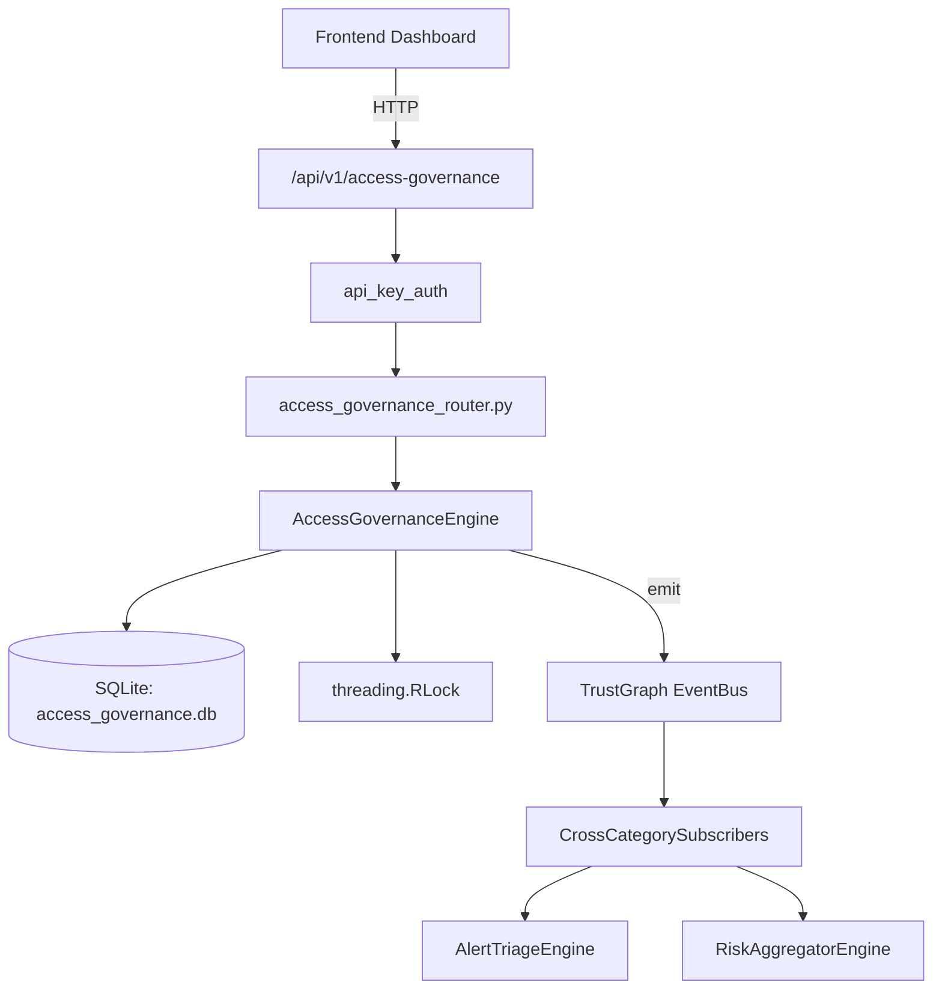

# US-0003: Access Governance

## Sub-Epic: Identity
**Master Goal**: ALDECI — $35/mo enterprise security intelligence platform replacing $50K-500K/yr tools

## User Story
As a **Robert Kim (Compliance Officer)**, I need to enforce access policies for SOC2/NIST compliance
so that the platform delivers enterprise-grade identity capabilities at 1/1000th the cost of legacy tools.

## Why This Matters
Access Governance replaces functionality found in enterprise tools like CrowdStrike, Wiz, Snyk, and Rapid7.
By building this into ALDECI's $35/mo stack, customers save $50K+/yr on standalone Identity tooling.

## Architecture

## Current State: 95% Complete
- ✅ `grant_entitlement()` — Grant an entitlement to a user for a resource. (line 137)
- ✅ `revoke_entitlement()` — Revoke an entitlement (org-scoped). (line 185)
- ✅ `get_user_entitlements()` — Return entitlements for a user, optionally filtered by status. (line 212)
- ✅ `get_expiring_entitlements()` — Return active entitlements expiring within days_ahead days. (line 234)
- ✅ `detect_sod_violations()` — Detect SoD violations for a user against a list of rules. (line 261)
- ✅ `acknowledge_violation()` — Acknowledge a SoD violation. (line 331)
- ❌ TrustGraph event emission — not yet verified

## Key Functions (from `suite-core/core/access_governance_engine.py` — 497 lines)
- `AccessGovernanceEngine.grant_entitlement()` — Grant an entitlement to a user for a resource. (line 137)
- `AccessGovernanceEngine.revoke_entitlement()` — Revoke an entitlement (org-scoped). (line 185)
- `AccessGovernanceEngine.get_user_entitlements()` — Return entitlements for a user, optionally filtered by status. (line 212)
- `AccessGovernanceEngine.get_expiring_entitlements()` — Return active entitlements expiring within days_ahead days. (line 234)
- `AccessGovernanceEngine.detect_sod_violations()` — Detect SoD violations for a user against a list of rules. (line 261)
- `AccessGovernanceEngine.acknowledge_violation()` — Acknowledge a SoD violation. (line 331)
- `AccessGovernanceEngine.create_role()` — Create a new role definition. (line 367)
- `AccessGovernanceEngine.assign_role_to_user()` — Assign a role to a user: increments user_count, grants per-permission entitlemen (line 410)

## Dependencies
- **Depends on**: standalone
- **Depended by**: Routers, TrustGraph EventBus, CrossCategorySubscribers
- **TrustGraph**: Event emission wired via ResponseInterceptorMiddleware
- **Source file**: `suite-core/core/access_governance_engine.py` (497 lines)
- **Router file**: `suite-api/apps/api/access_governance_router.py`

## API Endpoints
| Method | Path | Description |
|--------|------|-------------|
| POST | `/api/v1/access-governance/entitlements` | grant entitlement |
| POST | `/api/v1/access-governance/entitlements/{entitlement_id}/revoke` | revoke entitlement |
| POST | `/api/v1/access-governance/sod/detect` | detect sod violations |
| POST | `/api/v1/access-governance/violations/{violation_id}/acknowledge` | acknowledge violation |
| POST | `/api/v1/access-governance/roles` | create role |
| POST | `/api/v1/access-governance/roles/{role_id}/assign` | assign role to user |
| GET | `/api/v1/access-governance/users/{user_id}/entitlements` | get user entitlements |
| GET | `/api/v1/access-governance/expiring` | get expiring entitlements |
| GET | `/api/v1/access-governance/summary` | get access summary |

## Tasks Remaining
1. Verify TrustGraph event emission works end-to-end (2h)
2. Add integration test with real persona workflow (2h)
3. Wire CrossCategorySubscriber consumer chain (1h)
4. Validate with 30-persona walkthrough (1h)
5. Optimize query performance for large datasets (2h)
6. Expand test coverage to edge cases (2h)

## Definition of Done
- [ ] Robert Kim (Compliance Officer) can access /api/v1/access-governance and get meaningful data
- [ ] All CRUD operations return correct HTTP status codes
- [ ] TrustGraph receives events from this engine
- [ ] 36+ tests passing in `tests/test_access_governance_engine.py`
- [ ] 30-persona walkthrough includes this endpoint at 100%
- [ ] No hardcoded org_id — all queries are org-scoped

## Sprint: Wave 42 (est. April 18-20, 2026)

## Test Coverage
- **Test file**: `tests/test_access_governance_engine.py`
- **Tests**: 36 tests
- **Status**: Passing
