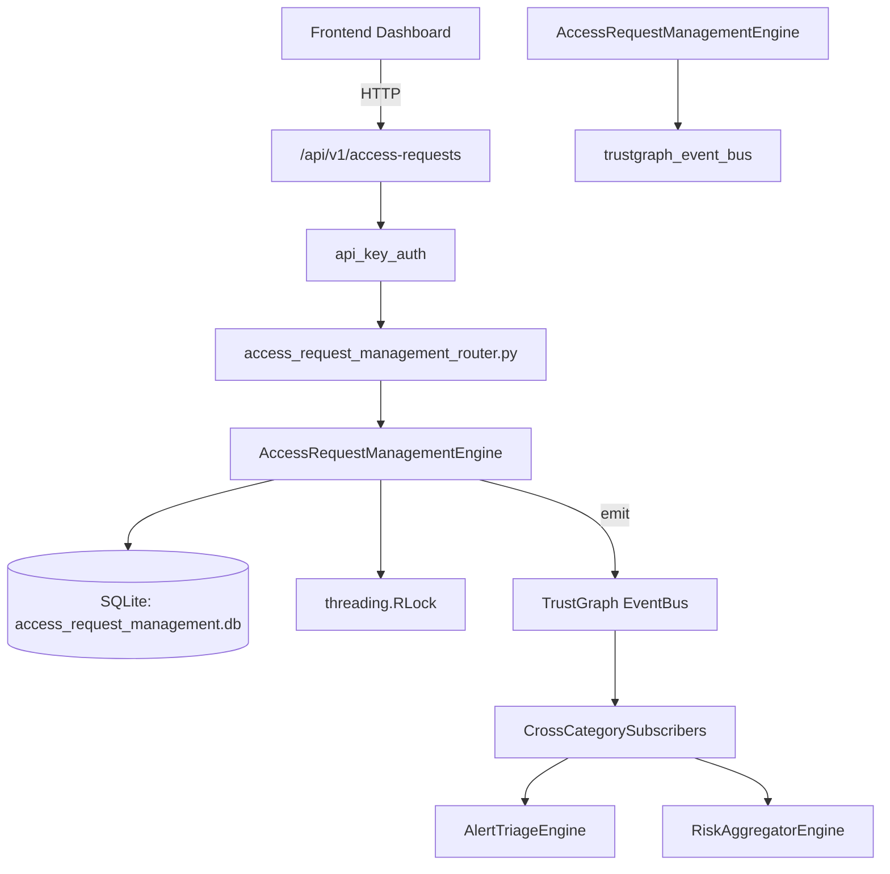

# US-0004: Access Request Management

## Sub-Epic: Identity
**Master Goal**: ALDECI — $35/mo enterprise security intelligence platform replacing $50K-500K/yr tools

## User Story
As a **Robert Kim (Compliance Officer)**, I need to enforce access policies for SOC2/NIST compliance
so that the platform delivers enterprise-grade identity capabilities at 1/1000th the cost of legacy tools.

## Why This Matters
Access Request Management replaces functionality found in enterprise tools like CrowdStrike, Wiz, Snyk, and Rapid7.
By building this into ALDECI's $35/mo stack, customers save $50K+/yr on standalone Identity tooling.

## Architecture

## Current State: 95% Complete
- ✅ `create_request()` — Create a new access request. Returns the created record. (line 103)
- ✅ `list_requests()` — List access requests for org, optionally filtered. (line 161)
- ✅ `get_request()` — Fetch a single request scoped to org_id. Returns None if not found. (line 185)
- ✅ `approve_request()` — Approve an access request. Sets approved_at and computes expires_at. (line 194)
- ✅ `reject_request()` — Reject an access request. Records approver and rejection reason. (line 225)
- ✅ `revoke_access()` — Revoke a previously approved access request. (line 250)
- ❌ TrustGraph event emission — not yet verified

## Key Functions (from `suite-core/core/access_request_management_engine.py` — 330 lines)
- `AccessRequestManagementEngine.create_request()` — Create a new access request. Returns the created record. (line 103)
- `AccessRequestManagementEngine.list_requests()` — List access requests for org, optionally filtered. (line 161)
- `AccessRequestManagementEngine.get_request()` — Fetch a single request scoped to org_id. Returns None if not found. (line 185)
- `AccessRequestManagementEngine.approve_request()` — Approve an access request. Sets approved_at and computes expires_at. (line 194)
- `AccessRequestManagementEngine.reject_request()` — Reject an access request. Records approver and rejection reason. (line 225)
- `AccessRequestManagementEngine.revoke_access()` — Revoke a previously approved access request. (line 250)
- `AccessRequestManagementEngine.get_access_stats()` — Return aggregate stats for access requests in org. (line 273)

## Dependencies
- **Depends on**: trustgraph_event_bus
- **Depended by**: Routers, TrustGraph EventBus, CrossCategorySubscribers
- **TrustGraph**: Event emission wired via ResponseInterceptorMiddleware
- **Source file**: `suite-core/core/access_request_management_engine.py` (330 lines)
- **Router file**: `suite-api/apps/api/access_request_management_router.py`

## API Endpoints
| Method | Path | Description |
|--------|------|-------------|
| POST | `/api/v1/access-requests/requests` | create request |
| GET | `/api/v1/access-requests/requests` | list requests |
| GET | `/api/v1/access-requests/requests/{request_id}` | get request |
| POST | `/api/v1/access-requests/requests/{request_id}/approve` | approve request |
| POST | `/api/v1/access-requests/requests/{request_id}/reject` | reject request |
| POST | `/api/v1/access-requests/requests/{request_id}/revoke` | revoke access |
| GET | `/api/v1/access-requests/stats` | get access stats |

## Tasks Remaining
1. Verify TrustGraph event emission works end-to-end (2h)
2. Add integration test with real persona workflow (2h)
3. Wire CrossCategorySubscriber consumer chain (1h)
4. Validate with 30-persona walkthrough (1h)
5. Optimize query performance for large datasets (2h)
6. Expand test coverage to edge cases (2h)

## Definition of Done
- [ ] Robert Kim (Compliance Officer) can access /api/v1/access-requests and get meaningful data
- [ ] All CRUD operations return correct HTTP status codes
- [ ] TrustGraph receives events from this engine
- [ ] 45+ tests passing in `tests/test_access_request_management_engine.py`
- [ ] 30-persona walkthrough includes this endpoint at 100%
- [ ] No hardcoded org_id — all queries are org-scoped

## Sprint: Wave 42 (est. April 18-20, 2026)

## Test Coverage
- **Test file**: `tests/test_access_request_management_engine.py`
- **Tests**: 45 tests
- **Status**: Passing
