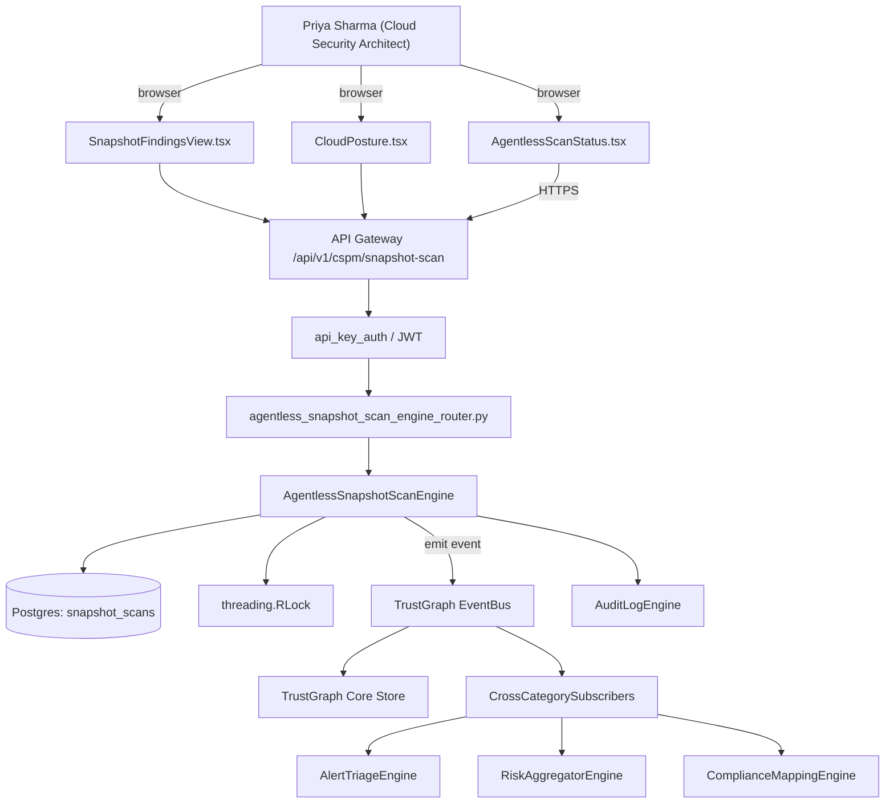

# US-0020: Deliver agentless snapshot-based workload scanning for AWS/Azure/GCP (Wiz/Orca SideScanning parity)

## Sub-Epic: CSPM
**Master Goal**: ALDECI — tiered $199-$1,499/mo enterprise security intelligence platform replacing $50K-$500K/yr tools

## User Story
As a **Priya Sharma (Cloud Security Architect)**, I need to deliver agentless snapshot-based workload scanning for AWS/Azure/GCP so that Fixops reaches Wiz/Orca CNAPP parity so cloud teams consolidate onto ALDECI.

## Why This Matters
Per competitor-cspm.md §1 and §3, customers refuse agents for posture. Without snapshot scanning Fixops loses every CSPM/CNAPP RFP. Build snapshot-based OS/package/vuln/secret/malware discovery via cloud-provider block-storage APIs.

This work is called out as a P0 gap in `competitor-cspm.md`. Shipping it is load-bearing for ALDECI's tiered $199-$1,499/mo positioning against $50K-$500K/yr incumbents: every delayed gap becomes a displacement deal we lose.

## Architecture

## Current State: 0% — MISSING (new engine)
- [ ] Engine module `suite-core/core/agentless_snapshot_scan_engine.py` does not exist yet
- [ ] Router `suite-api/apps/api/agentless_snapshot_scan_engine_router.py` does not exist yet
- [ ] DB tables listed under Data Model do not exist yet
- [ ] Frontend screens listed under Key Functions do not exist yet
- [ ] No TrustGraph events emitted yet

## Key Functions
**Backend (engine methods):**
- `create_snapshot_scan()` — backs `POST /api/v1/cspm/snapshot-scan`
- `get_findings()` — backs `GET /api/v1/cspm/snapshot/{id}/findings`
- `get_coverage()` — backs `GET /api/v1/cspm/coverage`

**Frontend screens:**
- `AgentlessScanStatus.tsx` — operator-facing UI surface for this gap
- `SnapshotFindingsView.tsx` — operator-facing UI surface for this gap
- `CloudPosture.tsx` — operator-facing UI surface for this gap

## API Endpoints
| Method | Path | Auth | Purpose |
|--------|------|------|---------|
| POST | `/api/v1/cspm/snapshot-scan` | api_key_auth | cspm snapshot scan |
| GET | `/api/v1/cspm/snapshot/{id}/findings` | api_key_auth | {id} findings |
| GET | `/api/v1/cspm/coverage` | api_key_auth | cspm coverage |

## Data Model
- add snapshot_scans table: id, account_id, resource_arn, status, started_at, completed_at, cost_cents, coverage_gap_reason

## Dependencies
**Depends on**: none explicit
**Depended by**: Router layer, TrustGraph EventBus, CrossCategorySubscribers, CrossCategoryEvidenceBuilder, AuditLogEngine
**New engine module**: `suite-core/core/agentless_snapshot_scan_engine.py`
**New router module**: `suite-api/apps/api/agentless_snapshot_scan_engine_router.py`
**Master gap id**: `GAP-020` (priority P0, effort XL)

## Tasks Remaining
1. Schema migration: add snapshot_scans table (4h)
2. Implement endpoint POST /api/v1/cspm/snapshot-scan (6h)
3. Implement endpoint GET /api/v1/cspm/snapshot/{id}/findings (6h)
4. Implement endpoint GET /api/v1/cspm/coverage (6h)
5. Wire frontend screen AgentlessScanStatus.tsx (5h)
6. Wire frontend screen SnapshotFindingsView.tsx (5h)
7. Wire frontend screen CloudPosture.tsx (5h)
8. Write 6 pytest cases: test_aws_ebs_snapshot_scan_extracts_packages, test_azure_disk_snapshot_scan… (6h)
9. Wire TrustGraph event emission + CrossCategorySubscriber consumers (4h)
10. Persona walkthrough + integration test (3h)
11. Docs + API reference update (2h)

## Definition of Done
- [ ] Given AWS credentials with required IAM permissions, When the scanner is triggered on an EC2 instance, Then it snapshots the EBS volume, mounts out-of-band, extracts OS packages + installed vulns + detected secrets without touching the live instance.
- [ ] Given the scan completes, When findings are ingested, Then each finding carries `scan_method=agentless_snapshot` and a reference to the scan_id.
- [ ] Given AgentlessScanStatus.tsx, When a user opens the page, Then they see per-account scan coverage (% of eligible workloads scanned in the last 24h).
- [ ] Given a requested on-demand scan via POST /api/v1/cspm/snapshot-scan, When triggered, Then a scan_id is returned and SnapshotFindingsView.tsx shows progress.
- [ ] Given a workload that cannot be scanned (encrypted with unshared key), When scanner runs, Then a coverage gap is recorded with reason and displayed on the dashboard.
- [ ] Given multi-account AWS Organization, When onboarded, Then the scanner discovers all accounts and surfaces per-account scan status.
- [ ] Given the scan completes, When costs are reported, Then snapshot-IO and data-transfer costs are logged per scan.
- [ ] All endpoints are org-scoped (no hardcoded org_id) and gated by `api_key_auth`.
- [ ] TrustGraph emits at least one event type for this engine and a CrossCategorySubscriber consumes it.
- [ ] `Priya Sharma (Cloud Security Architect)` can execute the full workflow in the 30-persona walkthrough.

## Tests Required
- `test_aws_ebs_snapshot_scan_extracts_packages`
- `test_azure_disk_snapshot_scan`
- `test_gcp_pd_snapshot_scan`
- `test_encrypted_unshared_key_coverage_gap`
- `test_on_demand_scan_returns_id`
- `test_multi_account_org_discovery`

## Sprint: Wave 43 (est. Apr 22-Apr 28, 2026)

## Citation
Source research: `competitor-cspm.md` (gap `GAP-020`, priority `P0`, effort `XL`)
