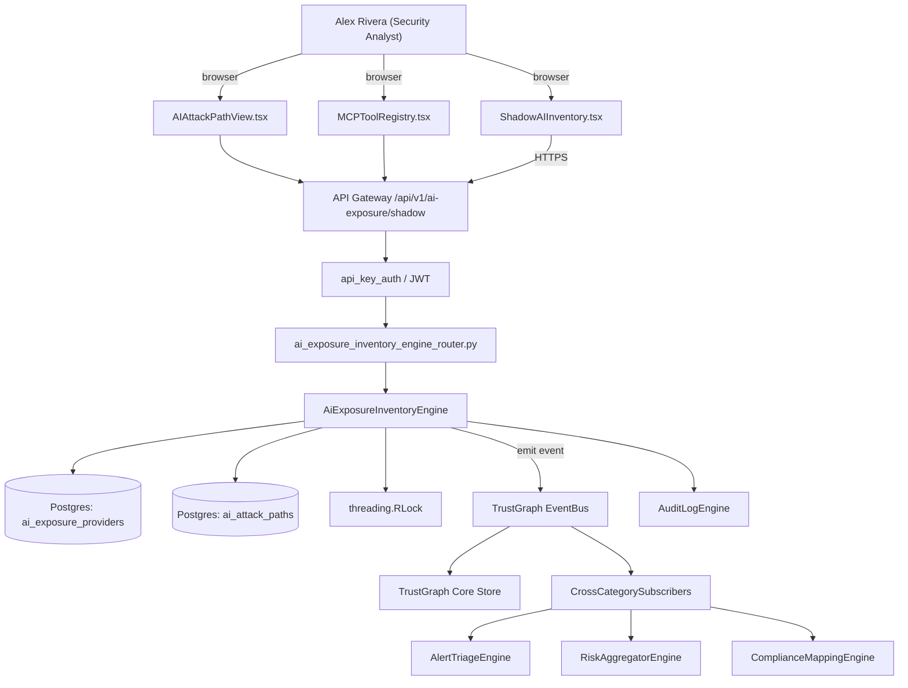

# US-0059: Launch AI Exposure module: shadow-AI inventory + AI-specific attack paths

## Sub-Epic: AI/Copilot
**Master Goal**: ALDECI — tiered $199-$1,499/mo enterprise security intelligence platform replacing $50K-$500K/yr tools

## User Story
As a **Alex Rivera (Security Analyst)**, I need to launch AI Exposure module: shadow-AI inventory + AI-specific attack paths so that ALDECI AI console differentiates vs point-tool AI copilots.

## Why This Matters
Per competitor-ctem.md §1, Tenable's 2026 AI Exposure inventories sanctioned + shadow AI (chatbots, agents, SaaS LLMs) and surfaces AI-specific attack paths. Fixops has `ai_governance`, `mcp_router`; add discovery of shadow AI usage + AI attack-path modeling.

This work is called out as a P1 gap in `competitor-ctem.md`. Shipping it is load-bearing for ALDECI's tiered $199-$1,499/mo positioning against $50K-$500K/yr incumbents: every delayed gap becomes a displacement deal we lose.

## Architecture

## Current State: 0% — MISSING (new engine)
- [ ] Engine module `suite-core/core/ai_exposure_inventory_engine.py` does not exist yet
- [ ] Router `suite-api/apps/api/ai_exposure_inventory_engine_router.py` does not exist yet
- [ ] DB tables listed under Data Model do not exist yet
- [ ] Frontend screens listed under Key Functions do not exist yet
- [ ] No TrustGraph events emitted yet

## Key Functions
**Backend (engine methods):**
- `get_shadow()` — backs `GET /api/v1/ai-exposure/shadow`
- `create_attack_path()` — backs `POST /api/v1/ai-exposure/attack-path`
- `create_sanctioned_list()` — backs `POST /api/v1/ai-exposure/sanctioned-list`

**Frontend screens:**
- `ShadowAIInventory.tsx` — operator-facing UI surface for this gap
- `AIAttackPathView.tsx` — operator-facing UI surface for this gap
- `MCPToolRegistry.tsx` — operator-facing UI surface for this gap

## API Endpoints
| Method | Path | Auth | Purpose |
|--------|------|------|---------|
| GET | `/api/v1/ai-exposure/shadow` | api_key_auth | ai exposure shadow |
| POST | `/api/v1/ai-exposure/attack-path` | api_key_auth | ai exposure attack path |
| POST | `/api/v1/ai-exposure/sanctioned-list` | api_key_auth | ai exposure sanctioned list |

## Data Model
- add ai_exposure_providers table: id, org_id, provider, bu, sanctioned (bool), first_seen, last_seen
- add ai_attack_paths table: id, org_id, path_nodes (JSONB), kind (prompt_injection|data_exfil|etc), severity

## Dependencies
**Depends on**: none explicit
**Depended by**: Router layer, TrustGraph EventBus, CrossCategorySubscribers, CrossCategoryEvidenceBuilder, AuditLogEngine
**New engine module**: `suite-core/core/ai_exposure_inventory_engine.py`
**New router module**: `suite-api/apps/api/ai_exposure_inventory_engine_router.py`
**Master gap id**: `GAP-059` (priority P1, effort L)

## Tasks Remaining
1. Schema migration: add ai_exposure_providers table (4h)
2. Schema migration: add ai_attack_paths table (4h)
3. Implement endpoint GET /api/v1/ai-exposure/shadow (6h)
4. Implement endpoint POST /api/v1/ai-exposure/attack-path (6h)
5. Implement endpoint POST /api/v1/ai-exposure/sanctioned-list (6h)
6. Wire frontend screen ShadowAIInventory.tsx (5h)
7. Wire frontend screen AIAttackPathView.tsx (5h)
8. Wire frontend screen MCPToolRegistry.tsx (5h)
9. Write 4 pytest cases: test_sso_logs_discovery_of_saas_llm, test_prompt_injection_path_detected… (6h)
10. Wire TrustGraph event emission + CrossCategorySubscriber consumers (4h)
11. Persona walkthrough + integration test (3h)
12. Docs + API reference update (2h)

## Definition of Done
- [ ] Given SSO logs and egress traffic metadata, When the engine runs, Then it discovers SaaS LLM usage (ChatGPT, Claude, Gemini, etc.) and shows counts per BU.
- [ ] Given ShadowAIInventory.tsx, When a user clicks a provider, Then the usage history, sanctioned/unsanctioned status, and exposure risk are displayed.
- [ ] Given an MCP agent registered in Fixops, When queried, Then its scopes, data access, and last-activity are shown.
- [ ] Given AIAttackPathView.tsx, When a prompt-injection attack path is detected (e.g., user uploads doc -> LLM reads -> action executed), Then the path is rendered with each node annotated.
- [ ] Given a shadow AI provider is newly detected, When surfaced, Then an alert is emitted and tagged for governance review.
- [ ] Given a sanctioned-list update, When an admin adds a provider, Then it is reclassified without re-scan.
- [ ] All endpoints are org-scoped (no hardcoded org_id) and gated by `api_key_auth`.
- [ ] TrustGraph emits at least one event type for this engine and a CrossCategorySubscriber consumes it.
- [ ] `Alex Rivera (Security Analyst)` can execute the full workflow in the 30-persona walkthrough.

## Tests Required
- `test_sso_logs_discovery_of_saas_llm`
- `test_prompt_injection_path_detected`
- `test_new_shadow_provider_alert`
- `test_sanctioned_reclassification`

## Sprint: Wave 46 (est. May 13-May 19, 2026)

## Citation
Source research: `competitor-ctem.md` (gap `GAP-059`, priority `P1`, effort `L`)
