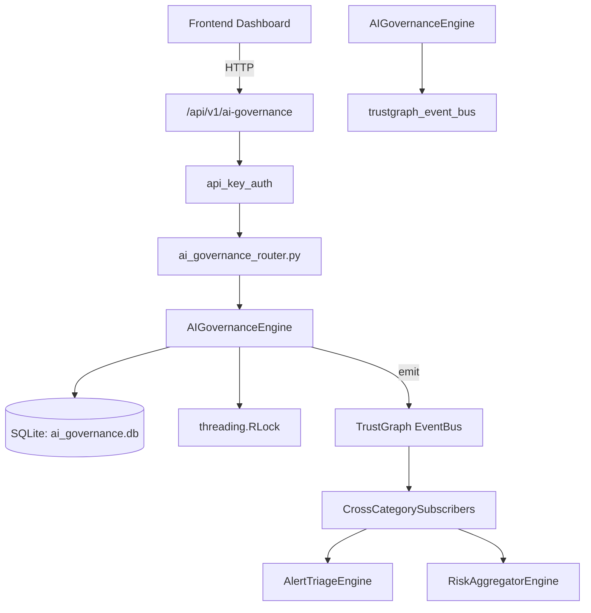

# US-0005: Ai Governance

## Sub-Epic: AI Intelligence
**Master Goal**: ALDECI — $35/mo enterprise security intelligence platform replacing $50K-500K/yr tools

## User Story
As a **Chris Lee (Security Data Scientist)**, I need to leverage AI/ML for threat detection and analysis
so that the platform delivers enterprise-grade ai intelligence capabilities at 1/1000th the cost of legacy tools.

## Why This Matters
Ai Governance replaces functionality found in enterprise tools like CrowdStrike, Wiz, Snyk, and Rapid7.
By building this into ALDECI's $35/mo stack, customers save $50K+/yr on standalone AI Intelligence tooling.

## Architecture

## Current State: 95% Complete
- ✅ `register_model()` — Register a new AI/ML model. (line 159)
- ✅ `list_models()` — List AI models with optional filters. (line 227)
- ✅ `get_model()` — Retrieve a single model by ID. (line 251)
- ✅ `update_model_status()` — Update deployment status of a model. (line 260)
- ✅ `record_assessment()` — Record a model risk assessment. (line 287)
- ✅ `list_assessments()` — List assessments with optional filters. (line 341)
- ❌ TrustGraph event emission — not yet verified

## Key Functions (from `suite-core/core/ai_governance_engine.py` — 503 lines)
- `AIGovernanceEngine.register_model()` — Register a new AI/ML model. (line 159)
- `AIGovernanceEngine.list_models()` — List AI models with optional filters. (line 227)
- `AIGovernanceEngine.get_model()` — Retrieve a single model by ID. (line 251)
- `AIGovernanceEngine.update_model_status()` — Update deployment status of a model. (line 260)
- `AIGovernanceEngine.record_assessment()` — Record a model risk assessment. (line 287)
- `AIGovernanceEngine.list_assessments()` — List assessments with optional filters. (line 341)
- `AIGovernanceEngine.report_incident()` — Report an AI incident. (line 365)
- `AIGovernanceEngine.resolve_incident()` — Resolve an AI incident. (line 412)

## Dependencies
- **Depends on**: trustgraph_event_bus
- **Depended by**: Routers, TrustGraph EventBus, CrossCategorySubscribers
- **TrustGraph**: Event emission wired via ResponseInterceptorMiddleware
- **Source file**: `suite-core/core/ai_governance_engine.py` (503 lines)
- **Router file**: `suite-api/apps/api/ai_governance_router.py`

## API Endpoints
| Method | Path | Description |
|--------|------|-------------|
| POST | `/api/v1/ai-governance/models` | register model |
| GET | `/api/v1/ai-governance/models` | list models |
| GET | `/api/v1/ai-governance/models/{model_id}` | get model |
| PUT | `/api/v1/ai-governance/models/{model_id}/status` | update model status |
| POST | `/api/v1/ai-governance/assessments` | record assessment |
| GET | `/api/v1/ai-governance/assessments` | list assessments |
| POST | `/api/v1/ai-governance/incidents` | report incident |
| PUT | `/api/v1/ai-governance/incidents/{incident_id}/resolve` | resolve incident |
| GET | `/api/v1/ai-governance/incidents` | list incidents |
| GET | `/api/v1/ai-governance/stats` | get governance stats |

## Tasks Remaining
1. Verify TrustGraph event emission works end-to-end (2h)
2. Add integration test with real persona workflow (2h)
3. Wire CrossCategorySubscriber consumer chain (1h)
4. Validate with 30-persona walkthrough (1h)
5. Optimize query performance for large datasets (2h)
6. Expand test coverage to edge cases (2h)

## Definition of Done
- [ ] Chris Lee (Security Data Scientist) can access /api/v1/ai-governance and get meaningful data
- [ ] All CRUD operations return correct HTTP status codes
- [ ] TrustGraph receives events from this engine
- [ ] 28+ tests passing in `tests/test_ai_governance_engine.py`
- [ ] 30-persona walkthrough includes this endpoint at 100%
- [ ] No hardcoded org_id — all queries are org-scoped

## Sprint: Wave 42 (est. April 18-20, 2026)

## Test Coverage
- **Test file**: `tests/test_ai_governance_engine.py`
- **Tests**: 28 tests
- **Status**: Passing
